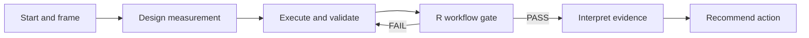

# Becoming an AI-Augmented Analyst

This portfolio artifact presents my five-stage analytical workflow for turning technical reporting into decision support:

1. **Start** — identify the business decision behind the metric request.
2. **Framing** — turn vague stakeholder language into one precise decision question.
3. **Design** — define the hypothesis, KPI, analytical grain, segments, confounders, and measurement risks before writing SQL.
4. **Execution** — produce and validate evidence with SQL, modular R/Tidyverse workflows, interpretable modeling, Excel outputs, and dashboards.
5. **Finish** — distinguish what the evidence supports from what it does not support and recommend a proportionate next action.

The objective is not merely faster reporting. It is better decisions grounded in transparent evidence. AI assists with structure, analytical design, independent review, and quality control; human judgment remains responsible for the evidence, interpretation, and recommendation.

## Deterministic workflow enforcement

The five-stage method now includes a separate **R Workflow Gate** that verifies that the required procedure was actually followed before Stage 5 begins.

This is distinct from Stage 4 analytical validation:

- **Stage 4 R-A / R-B reconciliation** asks whether the independent analytical implementations agree exactly on the locked judged logic.
- **The R Workflow Gate** asks whether the project completed the required stage locks, used the correct Stage 3 design version, passed fixtures and validation, and has zero unresolved validation failures.

The gate does not redesign the analysis or repair failed outputs. It reads machine-readable stage receipts and returns `PASS` or `FAIL`. Stage 5 is blocked unless the gate passes.

See [R Workflow Gate — Cross-Stage Procedural Enforcement](docs/r-workflow-gate-enforcement.md) and the executable script at [workflow-gate/workflow_gate.R](workflow-gate/workflow_gate.R).

## Packet index (stages 1–5)

| Stage | Document |
|---|---|
| 1–2 Start and Framing | [three-ai-start-and-framing-dialogue-framework.md](docs/three-ai-start-and-framing-dialogue-framework.md) |
| 3 Measurement Design | [three-ai-measurement-design-framework.md](docs/three-ai-measurement-design-framework.md) |
| 4 Execution, Validation, and Deeper Analysis | [three-ai-validation-and-analysis-framework.md](docs/three-ai-validation-and-analysis-framework.md) |
| 4 R execution prompt (optional) | [ENGINE.md](docs/ENGINE.md) — one-file tidyverse R Workflow Engine under Stage 4 |
| Cross-stage procedural enforcement | [r-workflow-gate-enforcement.md](docs/r-workflow-gate-enforcement.md) |
| 5 Interpretation and Recommendation | [three-ai-interpretation-and-recommendation-framework.md](docs/three-ai-interpretation-and-recommendation-framework.md) |

One-pager: [docs/PACKET.md](docs/PACKET.md).

Together, these documents specify the complete path from an initial stakeholder request to a validated, evidence-traceable decision, with deterministic checks that required procedural controls were not skipped or bypassed.

## Worked case studies

| Project | Decision supported | Evidence |
|---|---|---|
| [FulfillIQ 2.0](https://github.com/markjamesc/fulfilliq-2.0) | Which sellers meet the locked rules for investigation in a 30-day plan simulation? | independent SQL A / SQL B / R(B), reconciliation across 3,095 sellers, seven investigation candidates, two inconclusive cases, completed interpretation gates |
| [Bitcoin Proxy Analysis](https://github.com/markjamesc/ai-augmented-bitcoin-proxy-analysis) | Which public Bitcoin proxies, if any, are preferable to owning Bitcoin directly? | scenario model, executed notebook, internal QA checks, report and presentation |

[FulfillIQ V1](https://github.com/markjamesc/fulfilliq) remains the historical baseline. V2 is the current worked example.

The workflow repository explains the method; the case-study repositories show the method applied. The R Workflow Gate is intended for prospective use on new projects rather than retrofitting historical case studies merely for conformity.

## Portfolio files

- [Presentation (PDF)](Becoming_an_AI-Augmented_Analyst.pdf)
- [Editable PowerPoint](Becoming_an_AI-Augmented_Analyst.pptx)

## Technical foundation

SQL, R, Tidyverse, interpretable statistical modeling, Excel reporting and automation, dashboards, AI-assisted analytical validation, and deterministic R-based workflow enforcement.

## Related profiles

- [LinkedIn](https://www.linkedin.com/in/mark-ciganovic/)
- [GitHub](https://github.com/markjamesc/)

## Copyright and use

Copyright © 2026 Mark Ciganovic. All rights reserved.

This repository is not open source and does not grant permission to copy, distribute, modify, or incorporate its protected materials without prior written permission, except as permitted by applicable law and GitHub's Terms of Service. See [COPYRIGHT.md](COPYRIGHT.md) for the full notice.
