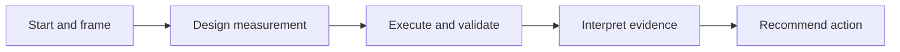

# Becoming an AI-Augmented Analyst

This portfolio artifact presents my five-stage analytical workflow for turning technical reporting into decision support:

1. **Start** — identify the business decision behind the metric request.
2. **Framing** — turn vague stakeholder language into one precise decision question.
3. **Design** — define the hypothesis, KPI, analytical grain, segments, confounders, and measurement risks before writing SQL.
4. **Execution** — produce and validate evidence with SQL, modular R/Tidyverse workflows, interpretable modeling, Excel outputs, and dashboards.
5. **Finish** — distinguish what the evidence supports from what it does not support and recommend a proportionate next action.

The objective is not merely faster reporting. It is better decisions grounded in transparent evidence. AI assists with structure, analytical design, independent review, and quality control; human judgment remains responsible for the evidence, interpretation, and recommendation.

## Detailed workflow frameworks

The repository contains completed documentation for all five stages:

- **Stages 1–2 — Start and Framing:** [Three-AI Start and Framing Dialogue Framework](docs/three-ai-start-and-framing-dialogue-framework.md)
- **Stage 3 — Measurement Design:** [Three-AI Measurement Design Framework](docs/three-ai-measurement-design-framework.md)
- **Stage 4 — Execution, Validation, and Deeper Analysis:** [Three-AI Independent Validation and Analysis Framework](docs/three-ai-validation-and-analysis-framework.md)
- **Stage 5 — Interpretation and Recommendation:** [Three-AI Interpretation and Recommendation Framework](docs/three-ai-interpretation-and-recommendation-framework.md)

Together, these documents specify the complete path from an initial stakeholder request to a validated, evidence-traceable decision.

## Worked case studies

| Project | Decision supported | Evidence |
|---|---|---|
| [FulfillIQ](https://github.com/markjamesc/fulfilliq) | Which sellers should enter a 30-day late-fulfillment performance plan? | MySQL, R, Excel evidence, three-AI review, decision brief |
| [Bitcoin Proxy Analysis](https://github.com/markjamesc/ai-augmented-bitcoin-proxy-analysis) | Which public Bitcoin proxies, if any, are preferable to owning Bitcoin directly? | Scenario model, reproducible notebook, validation checks, report and presentation |

The workflow repository explains the method; the case-study repositories show the method applied.

## Portfolio files

- [Presentation (PDF)](Becoming_an_AI-Augmented_Analyst.pdf)
- [Editable PowerPoint](Becoming_an_AI-Augmented_Analyst.pptx)

## Technical foundation

SQL, R, Tidyverse, interpretable statistical modeling, Excel reporting and automation, dashboards, and AI-assisted analytical validation.

## Related profiles

- [LinkedIn](https://www.linkedin.com/in/mark-ciganovic/)
- [GitHub](https://github.com/markjamesc/)

