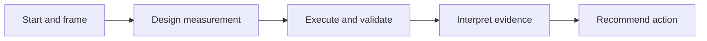

# Becoming an AI-Augmented Analyst

This portfolio artifact presents my five-stage analytical workflow for turning technical reporting into decision support:

1. **Start** — identify the business decision behind the metric request.
2. **Framing** — turn vague stakeholder language into one precise decision question.
3. **Design** — define the hypothesis, KPI, analytical grain, segments, confounders, and measurement risks before writing SQL.
4. **Execution** — produce and validate evidence with SQL, modular R/Tidyverse workflows, interpretable modeling, Excel outputs, and dashboards.
5. **Finish** — distinguish what the evidence supports from what it does not support and recommend a proportionate next action.

The objective is not merely faster reporting. It is better decisions grounded in transparent evidence. AI assists with structure, analytical design, independent review, and quality control; human judgment remains responsible for the evidence, interpretation, and recommendation.

## Packet index (stages 1–5)

| Stage | Document |
|---|---|
| 1–2 Start and Framing | [three-ai-start-and-framing-dialogue-framework.md](docs/three-ai-start-and-framing-dialogue-framework.md) |
| 3 Measurement Design | [three-ai-measurement-design-framework.md](docs/three-ai-measurement-design-framework.md) |
| 4 Execution, Validation, and Deeper Analysis | [three-ai-validation-and-analysis-framework.md](docs/three-ai-validation-and-analysis-framework.md) |
| 4 R execution prompt (optional) | [ENGINE.md](docs/ENGINE.md) — one-file tidyverse R Workflow Engine under Stage 4 |
| 5 Interpretation and Recommendation | [three-ai-interpretation-and-recommendation-framework.md](docs/three-ai-interpretation-and-recommendation-framework.md) |

One-pager: [docs/PACKET.md](docs/PACKET.md).

Together, these documents specify the complete path from an initial stakeholder request to a validated, evidence-traceable decision.

## Worked case studies

| Project | Decision supported | Evidence |
|---|---|---|
| [FulfillIQ 2.0](https://github.com/markjamesc/fulfilliq-2.0) | Which sellers meet the locked rules for investigation in a 30-day plan simulation? | independent SQL A / SQL B / R(B), reconciliation across 3,095 sellers, seven investigation candidates, two inconclusive cases, completed interpretation gates |
| [Bitcoin Proxy Analysis](https://github.com/markjamesc/ai-augmented-bitcoin-proxy-analysis) | Which public Bitcoin proxies, if any, are preferable to owning Bitcoin directly? | scenario model, executed notebook, internal QA checks, report and presentation |

[FulfillIQ V1](https://github.com/markjamesc/fulfilliq) remains the historical baseline. V2 is the current worked example.

The workflow repository explains the method; the case-study repositories show the method applied.

## Portfolio files

- [Presentation (PDF)](Becoming_an_AI-Augmented_Analyst.pdf)
- [Editable PowerPoint](Becoming_an_AI-Augmented_Analyst.pptx)

## Technical foundation

SQL, R, Tidyverse, interpretable statistical modeling, Excel reporting and automation, dashboards, and AI-assisted analytical validation.

## Related profiles

- [LinkedIn](https://www.linkedin.com/in/mark-ciganovic/)
- [GitHub](https://github.com/markjamesc/)

