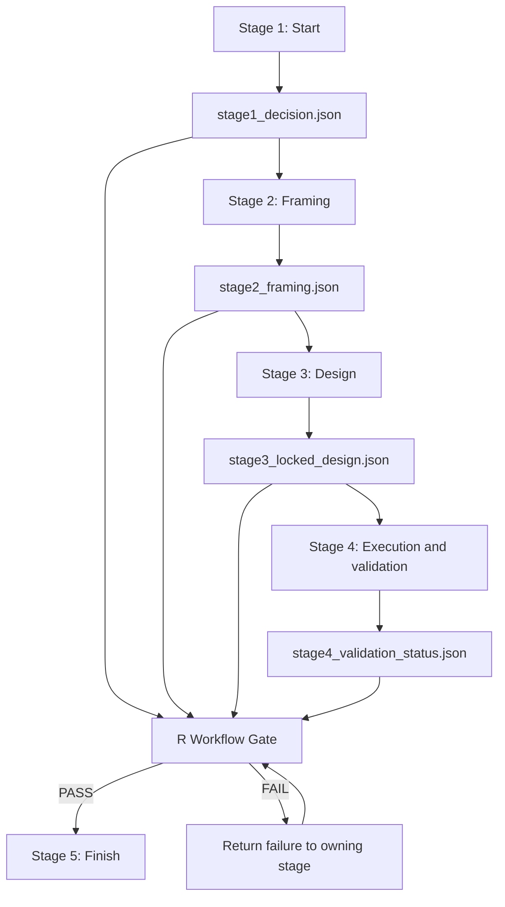

# R Workflow Gate — Cross-Stage Procedural Enforcement

**Prospective executable contract v2:** explicit capacity/ML modes, SHA-256 receipt verification, fixture and reconciliation scorecards, and lineage contents are now required. Install both `jsonlite` and `digest`. See [the schema and evidence boundary](../workflow-gate/CONTRACT_V2.md). Historical frozen project gates retain their original contract.

## Purpose

The existing five-stage method already specifies what the AIs and analyst must do. This control adds a deterministic R layer that verifies that the required procedure was actually completed before the workflow advances into Stage 5.

It is a **procedural gate**, not a new analytical path.

> **AI systems reason and construct. Stage 4 R-A / R-B validate the analysis. The R Workflow Gate verifies that the prescribed workflow was followed. The human analyst retains judgment.**

## What changes and what does not

The five stages remain unchanged:

1. Start
2. Framing
3. Design
4. Execution
5. Finish

The three-AI roles remain unchanged. The Stage 4 SQL Source Gate, independent R-A / R-B judged implementations, exact reconciliation, structural review, deeper analysis, and interpretation controls remain unchanged.

The new layer adds machine-readable evidence at the stage boundaries and one deterministic release check before Stage 5.

## Cross-stage architecture



## Stage 1 addition — decision status artifact

After the Start gate passes, the orchestrator writes:

```text
artifacts/stage1_decision.json
```

Minimum fields:

- `stage`
- `status = LOCKED`
- `decision_statement`
- `decision_owner`

This does not replace the full dialogue, Decision Ledger, or human/stakeholder approval record. It is a compact machine-readable receipt that the Start gate passed.

## Stage 2 addition — framing status artifact

After the Framing gate passes, the orchestrator writes:

```text
artifacts/stage2_framing.json
```

Minimum fields:

- `stage`
- `status = LOCKED`
- `analytical_question`

The full framing record remains authoritative. The JSON file is the deterministic transition artifact.

## Stage 3 addition — machine-readable locked measurement contract

Stage 3 already defines the measurement contract. The upgrade requires a compact machine-readable projection of the controlling fields:

```text
artifacts/stage3_locked_design.json
```

Minimum gate fields:

- `stage`
- `status = LOCKED`
- `design_version`
- `population`
- `grain`
- `window_start`
- `window_end`
- `decision_rules`
- `required_outputs`

Project-specific designs should add whatever additional locked fields actually control implementation, such as:

- inclusion / exclusion rules
- numerator / denominator definitions
- thresholds and volume floors
- missingness treatment
- duplicate / identity rules
- twin or persistence rules
- capacity rules
- action vocabulary
- reconciliation-critical columns
- source snapshot identity

The human-readable Stage 3 document remains the semantic authority. The JSON artifact is a deterministic implementation contract and version anchor.

## Stage 4 addition — validation status artifact

Stage 4 keeps its existing analytical validation architecture.

After the SQL Source Gate, fixtures, independent R-A / R-B judged implementations, exact reconciliation, structural review, and final Validation Gate are complete, Stage 4 writes:

```text
artifacts/stage4_validation_status.json
```

Minimum fields:

- `stage`
- `status`
- `design_version_used`
- `sql_source_gate`
- `fixtures`
- `r_a_status`
- `r_b_status`
- `reconciliation`
- `validation_gate`
- `unresolved_issues`

The status file is not the reconciliation itself. It is the machine-readable receipt for the already-completed Stage 4 validation process.

## R Workflow Gate

The gate script is:

```text
workflow-gate/workflow_gate.R
```

It verifies:

1. required stage artifacts exist;
2. the JSON parses;
3. required fields are present;
4. Stage 1 is locked;
5. Stage 2 is locked;
6. Stage 3 is locked;
7. Stage 4 used the exact Stage 3 `design_version`;
8. the SQL Source Gate passed;
9. frozen fixtures passed;
10. both independent judged R paths passed;
11. exact reconciliation passed;
12. the Stage 4 Validation Gate passed;
13. unresolved validation issues equal zero;
14. Stage 4 overall status is PASS.

The gate then writes:

```text
artifacts/workflow_gate_status.json
```

and returns:

- exit code `0` for PASS;
- exit code `1` for FAIL.

## Stage 5 hard entry condition

Stage 5 must not begin merely because the orchestrator believes Stage 4 is complete.

Before Stage 5, the orchestrator must run:

```bash
Rscript workflow-gate/workflow_gate.R <project-root>
```

Stage 5 may begin only if:

1. the process exit code is `0`; and
2. `workflow_gate_status.json` reports `PASS` and `stage5_allowed = true`.

If the gate fails, the orchestrator must:

1. stop progression;
2. read the failed checks;
3. route each failure to the stage that owns it;
4. repair from the authoritative locked design and evidence;
5. rerun affected work;
6. rerun the gate.

The gate may never repair R-A, R-B, the measurement design, or the evidence itself.

## Orchestrator / GrokBot integration rule

Add the following behavior to the master orchestration instructions:

> Treat machine-readable stage artifacts as required transition receipts. After Stage 4 validation is complete, invoke the local R Workflow Gate. Do not start Stage 5 unless the R process returns success and the gate artifact says PASS. On FAIL, report the failed checks, return each failure to its owning stage, preserve the locked design unless the failure proves the design itself is defective, rerun affected work, and rerun the gate. Never override or verbally waive a failed deterministic gate.

## Why the gate is separate from Stage 4 reconciliation

Stage 4 R-A / R-B reconciliation asks:

> **Did the independent analytical implementations agree exactly on the locked judged logic?**

The R Workflow Gate asks:

> **Did the project actually complete the required procedural controls, using the correct locked design, before advancing?**

Combining these functions would blur analytical validation and workflow enforcement. Keeping them separate makes failure ownership clearer and prevents the same code that builds or reconciles the answer from being the only mechanism that authorizes stage progression.

## Scope and limits

A gate PASS is strong evidence of procedural compliance. It is not proof that:

- the business decision was wisely chosen;
- the Stage 3 measurement design is conceptually optimal;
- the data source is sufficient for every inference;
- the validated result is causal;
- or the final recommendation is correct.

Those remain controlled by the three-AI reviews, source and methodological evidence, stakeholder constraints, and human judgment.

The gate exists to eliminate a narrower failure mode: **the workflow silently claiming completion while a required control was skipped, stale, failed, or bypassed.**

---

## FORWARD — Evidence receipts

For new / forward publishable project packs, treat `artifacts/workflow_gate_status.json` as a **required** procedural receipt alongside lineage and scorecard artifacts (minimum schema: status, `stage5_allowed`, `design_version`, fixture freeze hash, source snapshot id, recon result, validation result, timestamp). See the Stage 4 FORWARD evidence-package schema and [VERIFY_PACKET.md](VERIFY_PACKET.md). Prospective only — do not retrofit prior locked / frozen historical packs merely for conformity.
