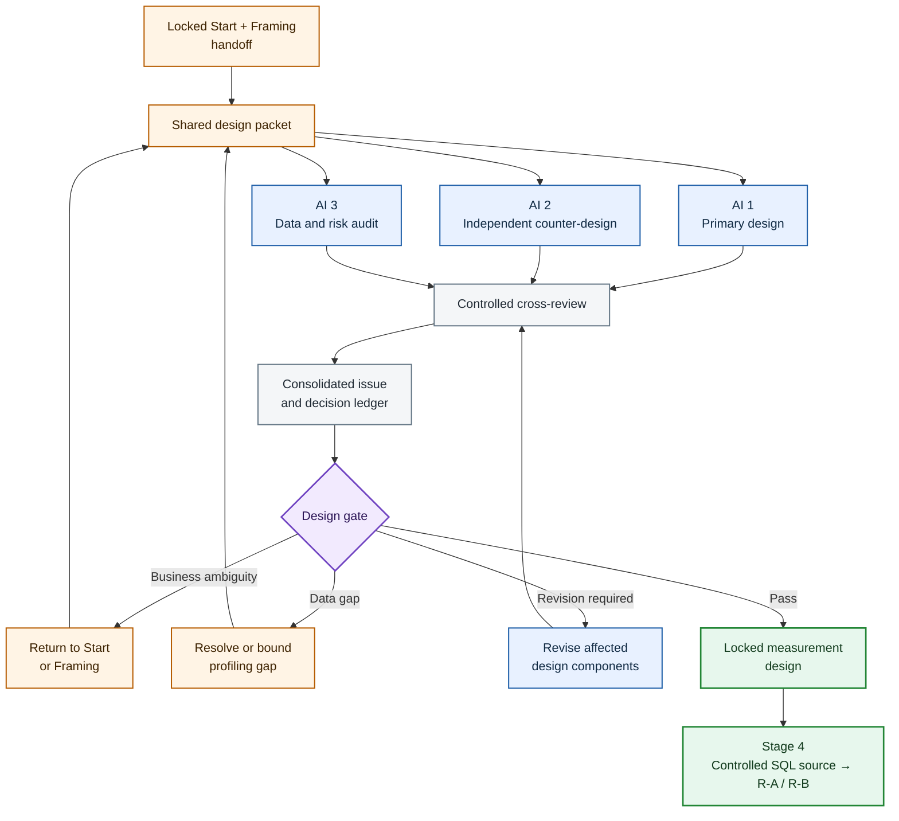
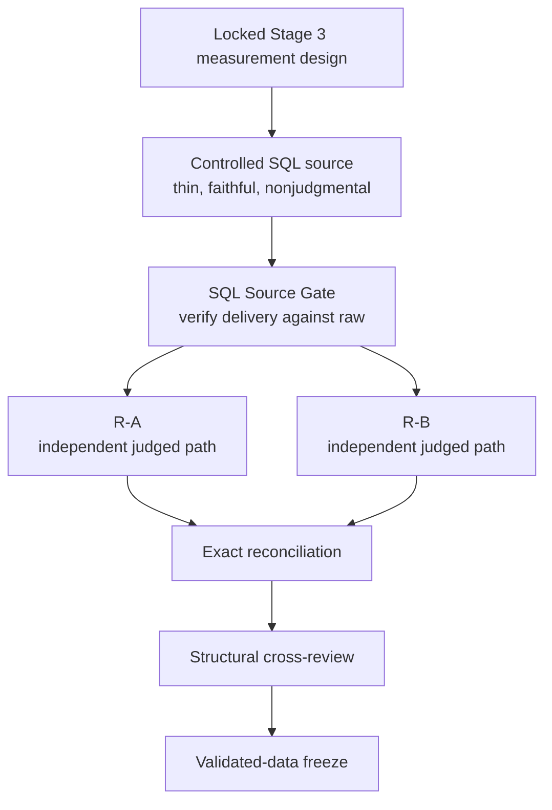

# Three-AI Measurement Design Framework

This framework governs Stage 3, **Design**, of the five-stage AI-Augmented Analyst process.

Its purpose is to convert an approved business decision and analytical question into a complete measurement contract before any production SQL or R code is written.

Stage 3 defines:

- the hypothesis;
- population and exclusions;
- analytical grain;
- primary KPI and supporting metrics;
- segments;
- confounders and competing explanations;
- data-quality and sample-size rules;
- decision rules;
- measurement risks;
- and the precise SQL→R handoff required by the current Stage 4 framework.

The three AIs perform different functions:

- **AI 1 constructs the primary measurement design.**
- **AI 2 independently constructs a counter-design and reviews methodological validity.**
- **AI 3 audits data feasibility, join structure, source-delivery requirements, and implementation risk.**

The governing principle is:

> Decide what would count as evidence before writing the code that produces it.

The AIs do not vote on a design. Each disagreement is resolved through the approved business question, explicit definitions, source-data evidence, methodological principles, or a disclosed human decision.

## 1. Position within the five-stage process

| Stage | Function | Controlling output |
|---|---|---|
| 1. Start | Identify the business decision | Approved decision statement |
| 2. Framing | Convert that decision into one analytical question | Locked analytical question |
| 3. Design | Define what must be measured and how evidence will be interpreted | Locked measurement design |
| 4. Execution | Deliver source data through SQL, validate that delivery, independently construct judged results in R-A and R-B, reconcile, review, and analyze | Validated analytical outputs |
| 5. Finish | Interpret the evidence and recommend a proportionate action | Evidence-traceable recommendation |

Stage 3 is the contract between the business question and the code.

It must be precise enough that independent builders can implement it without silently making different analytical decisions. It must not become production SQL or production R.

Stage 3 is intentionally aligned to the current Stage 4 division of labor:

- **SQL is the controlled source-delivery layer.** It retrieves and mechanically prepares the authorized source evidence.
- **The SQL Source Gate verifies that delivery against the authoritative source.**
- **R-A and R-B are the two independent judged implementations.** They independently apply the locked analytical logic.
- **Exact reconciliation compares R-A against R-B.**

This alignment does **not** move analytical judgment into SQL. Stage 3 still defines what concepts mean before implementation. It simply makes the Stage 4 handoff precise enough to match the owner's actual workflow: SQL for data retrieval and R for wrangling, analysis, and decision logic.

A change to Stage 4 implementation does not reopen the substantive Stage 3 measurement choices unless it reveals that the measurement contract itself is ambiguous, infeasible, incomplete, or materially altered.

## 2. What the design must establish

A complete measurement design answers nine distinct questions.

| Design layer | Controlling question |
|---|---|
| Decision alignment | What decision will this evidence support? |
| Hypothesis | What claim, mechanism, or expectation is being tested? |
| Population | Which observations are eligible, and which are excluded? |
| Grain | What does one analytical row represent at each stage? |
| Measurement | How are the primary KPI, guardrails, and diagnostics defined? |
| Comparison | Relative to what baseline, peer group, period, or counterfactual is the result judged? |
| Heterogeneity | Which segments or subgroups may differ meaningfully? |
| Alternative explanation | Which confounders, biases, and rival explanations could change interpretation? |
| Decision rule | How will possible results map to actions, uncertainty, or escalation? |

No single KPI answers all nine questions.

## 3. Required input package

All three AIs receive the same versioned Design Input Package.

### Required business inputs

- original stakeholder request;
- complete Start and Framing decision trail;
- approved decision statement;
- locked analytical question;
- decision owner;
- available actions;
- intended business outcome;
- time horizon;
- capacity, resource, policy, and risk constraints;
- required exceptions;
- and stakeholder approval record.

### Required data inputs

- database context;
- schema or data dictionary;
- table and column descriptions;
- primary and foreign-key expectations;
- source-system limitations;
- current data profile;
- known missingness, duplication, range, and anomaly findings;
- available time coverage;
- SQL/database dialect for Stage 4 source delivery;
- and any known R-side constraints material to independent reconstruction.

### Missing-input rule

If a required business input is missing, return to Start or Framing.

If a required data fact is missing, record a targeted profiling question. Do not invent a field, cardinality, coverage period, or data-quality condition.

Targeted profiling may inform Stage 3. Production SQL, production R, and deeper analysis remain prohibited until the design passes.

## 4. Human authority and AI boundaries

### Stakeholder or decision owner

The stakeholder controls:

- the practical decision;
- available actions;
- business priority;
- operational capacity;
- material exceptions;
- and acceptable business risk.

The stakeholder may propose metrics, but a proposed metric is not automatically a valid measurement definition.

### Human analyst

The human analyst owns:

- the final synthesis;
- analytical judgment where several defensible designs remain;
- escalation to the stakeholder;
- approval of disclosed working assumptions;
- and the lock authorizing Stage 4.

### AI boundaries

No AI may:

- rewrite the approved decision for convenience;
- invent unavailable fields;
- treat an operational concept as a database column without verification;
- select a desired conclusion in advance;
- silently change the population or grain;
- write production SQL;
- or write production R.

## 5. The three AI roles

### AI 1 — Primary Measurement Architect

AI 1 produces Design A from the locked input package.

Its responsibilities include:

- translating the approved question into testable hypotheses;
- defining population and exclusions;
- declaring every required grain;
- specifying KPI contracts;
- defining comparisons and baselines;
- selecting justified segments;
- identifying confounders and measurement risks;
- defining data-quality, sample-size, and sensitivity rules;
- constructing decision rules;
- and producing the Stage 4 SQL→R handoff contract.

AI 1 must distinguish business requirements from its own proposed analytical choices.

### AI 2 — Independent Counter-Designer and Methodological Critic

AI 2 independently produces Design B before seeing Design A.

AI 2 tests whether a materially different but defensible design follows from the same business question. It focuses on:

- construct validity;
- hypothesis falsifiability;
- denominator choice;
- baseline and comparison logic;
- selection bias;
- survivor bias;
- confounding;
- segment multiplicity;
- minimum sample rules;
- uncertainty;
- decision-threshold justification;
- and whether the proposed evidence could actually support the intended conclusion.

AI 2 must not disagree merely to create variety. Every alternative must identify the risk it solves and the tradeoff it introduces.

### AI 3 — Data Feasibility and Measurement-Risk Auditor

AI 3 first builds an independent Data and Risk Dossier without seeing Design A or Design B.

It examines:

- whether required concepts have source fields;
- table coverage;
- key uniqueness;
- join cardinality;
- duplicate risk;
- missingness;
- time coverage;
- date and timezone semantics;
- category consistency;
- leakage risk;
- post-outcome fields;
- partial-period effects;
- unsupported operational fields;
- what SQL must deliver for Stage 4;
- which transformations are mechanical enough to remain in SQL;
- which transformations must remain for independent R-A / R-B judgment;
- and whether the final judged outputs can be independently reconstructed and exactly reconciled.

During cross-review, AI 3 checks both designs against the verified data context and profile.

AI 3 may reject an implementable design if the measurement is conceptually invalid, and it may reject a conceptually attractive design if the required evidence does not exist.

## 6. Independence before cross-review

The initial outputs must be developed independently.

| AI | Initial output | Must not see initially |
|---|---|---|
| AI 1 | Complete Design A | Design B and AI 3 risk dossier |
| AI 2 | Complete Design B | Design A and AI 3 risk dossier |
| AI 3 | Data and Risk Dossier | Design A and Design B |

Independence reduces anchoring.

If AI 2 merely edits Design A, agreement between the designs has little value. If AI 3 sees a proposed grain before checking source relationships, it may rationalize the proposed joins instead of independently identifying cardinality risk.

After all three initial outputs are complete, the information barriers are removed for controlled cross-review.

## 7. Design status vocabulary

Every material design element receives one status:

- **Locked:** Approved and controlling for Stage 4.
- **Proposed:** Defensible but not yet approved.
- **Verified:** Supported by the data context or profile.
- **Provisional:** Required temporarily and subject to validation or sensitivity testing.
- **Disputed:** More than one defensible interpretation remains.
- **Open:** Information is insufficient.
- **Infeasible:** Required evidence is unavailable or unreliable.
- **Deferred:** Properly belongs to Stage 4 or Stage 5.
- **Rejected:** Fails business, methodological, or data review.

Stage 4 may implement only **Locked** elements. A provisional design choice may enter Stage 4 only when the design specifies how it will be tested and who accepted the risk.

## 8. Hypothesis contract

The design begins with the approved decision, not with a preferred technique.

### 8.1 Business hypothesis

State the decision-relevant expectation in plain language.

Example:

> A meaningful subset of eligible sellers has persistently elevated late-fulfillment rates and can be prioritized for intervention within the available program capacity.

### 8.2 Mechanism or rationale

State why the pattern might exist and why the proposed action could matter.

Do not convert a plausible story into an established causal mechanism.

### 8.3 Observable implication

State what pattern should appear if the hypothesis is useful.

Examples include:

- stable elevation relative to a justified baseline;
- concentration of risk in particular units or segments;
- persistence under reasonable measurement alternatives;
- or a meaningful difference large enough to change action.

### 8.4 Counterevidence

State what result would weaken or defeat the hypothesis.

A hypothesis that cannot lose is not controlling analytical guidance.

### 8.5 Statistical hypotheses where relevant

Use null and alternative hypotheses only when a statistical test genuinely contributes to the decision.

Do not add significance testing merely to make a descriptive decision process appear scientific.

### 8.6 Hypothesis hierarchy

Separate:

- primary business hypothesis;
- primary analytical hypothesis;
- secondary hypotheses;
- exploratory questions;
- and mechanism claims requiring stronger evidence.

Exploratory findings must not be presented later as if they were prespecified confirmatory tests.

## 9. Population and eligibility contract

The population contract must specify:

- target population;
- observable population;
- inclusion rules;
- exclusion rules;
- time window;
- lower-bound inclusivity;
- upper-bound exclusivity;
- status requirements;
- required non-null fields;
- unit eligibility;
- entity eligibility;
- and how excluded records will be counted and reported.

### Target versus observable population

The target population is the population about which the decision is intended.

The observable population is the subset represented in the available data.

The design must disclose any gap between them. A query cannot repair a coverage limitation by filtering it away.

### Exclusion discipline

Every exclusion must have:

- a reason;
- a stage at which it is applied;
- an expected effect;
- and an audit count.

A missing outcome should not be silently treated as a negative outcome. An inner join should not become an undocumented eligibility rule.

## 10. Analytical grain contract

Grain is the meaning of one row.

The design must declare grain at every material level:

| Layer | Grain question |
|---|---|
| Source | What does one source row represent? |
| SQL delivery | What source grain must SQL faithfully deliver to R? |
| Eligibility | At what unit is inclusion determined in R? |
| Event or observation | What counts once in the numerator or denominator? |
| Entity-period | At what level is the KPI calculated? |
| Segment | At what level are comparisons made? |
| Decision | At what level is action assigned? |

### Grain transition map

For each transition, record:

- input grain;
- output grain;
- grouping keys;
- deduplication rule;
- aggregation rule;
- expected row-count direction;
- and uniqueness assertion.

The design must distinguish **mechanical source-grain construction that SQL is allowed to perform** from **judged analytical grain transitions that R-A and R-B must implement independently**.

### Join cardinality contract

Before SQL is written, declare the expected relationship for every required source join:

- one-to-one;
- one-to-many;
- many-to-one;
- or many-to-many.

If a many-to-many relationship is legitimate, specify how it will be controlled. `DISTINCT` is not an acceptable substitute for understanding the duplication.

### Example

In a seller-fulfillment analysis, raw order items may contain several rows for the same seller within one order. If Stage 4 must mechanically join source tables before R can receive a meaningful extract, the design must state the authorized source grain and what source evidence must be preserved. If seller-order lateness is a judged analytical classification, R-A and R-B must still apply that locked meaning independently rather than receiving the final classification from SQL.

## 11. KPI and metric contract

Every KPI must be defined before implementation.

### Required KPI fields

| Field | Required definition |
|---|---|
| Metric name | Stable business-readable name |
| Purpose | Decision the metric supports |
| Grain | Level at which it is computed |
| Population | Eligible observations |
| Numerator | Exact event or quantity counted |
| Denominator | Exact opportunity set |
| Formula | Unambiguous mathematical definition |
| Time basis | Event date, calendar date, timestamp, cohort, or window |
| Direction | Whether higher or lower is better |
| Missingness | Treatment of absent components |
| Weighting | Entity-weighted, event-weighted, revenue-weighted, or other |
| Aggregation | How lower-grain values roll up |
| Precision | Internal calculation and display rules |
| Audit components | Counts required to reproduce the metric |
| Limitations | Known interpretive boundaries |

### Metric hierarchy

Separate:

- **Primary KPI:** The main decision metric.
- **Guardrail metrics:** Outcomes that must not deteriorate while optimizing the primary KPI.
- **Diagnostic metrics:** Measures that help explain the KPI.
- **Audit metrics:** Counts used to validate construction.
- **Sensitivity twins:** Alternative definitions used to test robustness.

Do not allow a diagnostic metric to replace the primary KPI during execution without reopening the design.

### Rate contract

For every rate, preserve numerator and denominator.

$$
\text{Rate} = \frac{\text{Qualified events}}{\text{Eligible opportunities}}
$$

A percentage without its components is insufficient for validation, sample-size assessment, or decision review.

### Date and timestamp rules

Define explicitly:

- date versus timestamp comparison;
- timezone;
- same-day treatment;
- missing timestamp treatment;
- late-arriving data;
- partial days or months;
- and half-open window boundaries.

These are Stage 3 semantic rules. Unless Stage 3 explicitly designates a particular operation as mechanical source plumbing, SQL must deliver the required source timestamps and R-A / R-B must independently apply the judged date logic.

## 12. Comparison and baseline contract

A value becomes decision-relevant only relative to an appropriate reference.

Possible references include:

- marketplace or portfolio baseline;
- peer group;
- prior period;
- target or SLA;
- matched comparison group;
- expected value from a model;
- or a no-action baseline.

The design must state:

- why the reference is appropriate;
- whether it is weighted;
- whether the focal unit contributes to its own baseline;
- how small peers are handled;
- whether seasonality matters;
- and what interpretation the comparison does and does not permit.

A percentile, average, target, and causal counterfactual are not interchangeable.

## 13. Segment contract

Segments are included because the decision may differ across groups, not because every available category should be explored.

For each segment, specify:

- business rationale;
- source field;
- transformation or grouping rule;
- expected category values;
- missing-category treatment;
- minimum group size;
- whether it is prespecified or exploratory;
- interaction or overlap with other segments;
- and the action that a segment difference could change.

### Segment priority

Classify segments as:

- required for the primary decision;
- required as a fairness or risk guardrail;
- diagnostic;
- exploratory;
- or excluded.

### Multiplicity risk

Testing many segments increases the chance of finding unstable extremes. The design must state whether segment findings are descriptive, confirmatory, adjusted for multiple testing, or subject to later validation.

## 14. Confounder and competing-explanation ledger

A confounder is not merely another available variable.

For each proposed confounder or competing explanation, record:

| Field | Required content |
|---|---|
| Risk ID | Stable identifier |
| Variable or mechanism | Exact factor |
| Why it matters | Path by which it could distort interpretation |
| Relation to exposure or segment | Why imbalance is plausible |
| Relation to outcome | Why the KPI could change |
| Available measure | Verified field or acknowledged absence |
| Planned treatment | Stratify, adjust, restrict, match, describe, sensitivity test, or disclose |
| Residual limitation | What remains unresolved |

Examples may include:

- volume;
- product mix;
- geography;
- seasonality;
- customer composition;
- tenure;
- order value;
- operational complexity;
- and exposure opportunity.

### Causal ceiling

Adjustment does not automatically establish causality.

The design must classify the intended conclusion as:

- descriptive;
- comparative;
- associational;
- predictive;
- or causal.

Every later claim must remain under that ceiling unless a stronger design is separately justified.

## 15. Data-quality and anomaly contract

Before execution, specify rules for:

- duplicate keys;
- impossible dates;
- negative or impossible values;
- category inconsistencies;
- outliers;
- partial periods;
- missing required fields;
- records outside the expected time range;
- conflicting source values;
- late-arriving records;
- and join failures.

For each issue, choose one action:

- exclude;
- correct from an authoritative source;
- retain and flag;
- winsorize or transform;
- analyze separately;
- perform sensitivity analysis;
- or pause for investigation.

No anomaly policy may be invented after results are seen merely because it improves the conclusion.

Stage 3 must also state whether each data-quality rule is:

- a **source-delivery concern** that SQL / the SQL Source Gate must preserve or verify; or
- a **judged analytical rule** that R-A and R-B must implement independently.

## 16. Sample-size and uncertainty contract

The design must specify where sample size affects:

- eligibility;
- ranking stability;
- segment reporting;
- confidence intervals;
- statistical testing;
- model validation;
- and decision thresholds.

### Minimum denominator

A minimum denominator may protect against unstable rates, but it requires a rationale.

Label the rule as:

- policy-based;
- statistically justified;
- empirically validated;
- or provisional.

A provisional threshold must not be presented later as an SLA or scientific constant.

### Uncertainty representation

Specify whether the output requires:

- raw numerator and denominator;
- interval estimates;
- shrinkage or partial pooling;
- suppression of tiny cells;
- sensitivity bands;
- or a stability flag.

## 17. Decision-rule contract

The decision rule connects evidence to action.

For every action category, specify:

- eligibility requirement;
- evidence threshold;
- comparison rule;
- capacity constraint;
- tie-breaking rule;
- guardrail;
- exception path;
- uncertainty treatment;
- and what happens when evidence is insufficient.

### Decision categories

Examples include:

- intervene;
- monitor;
- no action;
- escalate for review;
- or collect more evidence.

### Capacity-aware rules

If only a limited number of entities can receive intervention, the design must say whether priority is based on:

- rate severity;
- total events at risk;
- expected benefit;
- confidence-adjusted risk;
- policy priority;
- or a defined combination.

The selection logic must be fixed before the ranked results are viewed.

When the design uses persistence, twin-clock, or capacity selection, the decision-rule contract must also lock in R-A / R-B-translatable form:

- **Half-window persistence** (if used): non-overlapping halves; per-half floors + comparator; AND-of-halves persistence gate; half audit fields; no pooled-window collapse.
- **Dual-clock / twin action-override** (if used): real twin pipelines; post-capacity action disagree → INCONCLUSIVE / non-enrolling; twin evidence fields; no fake clocks.
- **Universe + membership-first + no-pad** (if used): full analytical-unit universe including zero-eligible / non-qualifiers; membership-first then rank under slots; select according to the locked capacity rule; no inventing entities to hit capacity.

These are judged rules. The controlled SQL source must not precompute their final classifications unless Stage 3 explicitly documents an unavoidable mechanical exception and Stage 4 independently validates that exception.

### What the rule does not establish

A decision threshold is a policy choice informed by evidence. It is not automatically:

- a natural boundary;
- an SLA;
- a causal effect threshold;
- or proof that entities immediately below it are meaningfully different.

## 18. Measurement-risk register

Every material risk receives:

| Field | Required content |
|---|---|
| Risk ID | Stable identifier |
| Design component | Population, grain, KPI, segment, confounder, threshold, source, or output |
| Failure mode | What could go wrong |
| Likelihood | Low, medium, high, or unknown |
| Decision impact | How the error could alter action |
| Detection control | Check that would reveal it |
| Prevention control | Design rule that reduces it |
| Sensitivity test | Alternative definition or scenario |
| Residual risk | What remains after controls |
| Status | Resolved, accepted, open, blocking, or deferred |

High-impact risks cannot be buried in prose. They must appear in the register and at the Design Gate.

The register should explicitly distinguish two Stage 4 implementation risks when relevant:

- **SQL delivery risk:** the wrong rows, wrong fields, wrong multiplicity, wrong join result, or wrong source values reach R.
- **R translation risk:** the correct source data reaches R, but wrangling or judged analytical logic is implemented incorrectly.

## 19. Non-executable SQL→R implementation blueprint

Stage 3 must describe the required transformation logic without writing production SQL or R.

The blueprint should identify:

1. authoritative source tables;
2. required source fields;
3. expected keys;
4. source join relationships;
5. controlled SQL source grain;
6. permitted SQL mechanical transformations;
7. prohibited SQL judged transformations;
8. population rules to be applied independently in R-A and R-B;
9. eligibility logic to be applied independently in R-A and R-B;
10. judged grain transitions;
11. metric components;
12. aggregations;
13. segment assignments;
14. decision classifications;
15. audit counts;
16. and required judged outputs.

Acceptable blueprint language:

> SQL delivers the required order, item, seller, status, and timestamp evidence at the authorized source grain without precomputing final eligibility or action. R-A and R-B independently establish the locked analytical grain, apply eligibility and lateness rules, aggregate the metric, and assign the final action.

Not acceptable during Stage 3: executable query syntax, CTE construction, production tidyverse code, or code written to produce the result.

The design defines what SQL must faithfully deliver and what R-A / R-B must independently judge. Stage 4 determines the exact code and validates both layers.

## 19A. Spec→builder translation and known-case fixtures

Stage 3 must be precise enough that R-A and R-B implement the *same* judged rules from the *same* verified source package. Prose design locks can still under-translate into implementation: omitted persistence logic, faked twin-action logic, or an incomplete analytical-unit universe can produce decision-changing differences until repaired toward the locked design. Worked evidence from earlier projects confirmed that translation drift is real and that fixtures can catch *translation* misses — they do not erase correlated shared-design error.

### Translation requirement (Spec→builder packet)

Every decision-changing rule in the locked design must map to an **R-A attestation** and an **R-B attestation** with an exact clause cite (section/ID). Builders may not treat unnamed “spirit of the design” as authority.

Stage 3 approves the complete translation contract and frozen fixture pack **without requiring production code**. Pre-build commitments, executed attestations, SQL Source Gate results, and frozen-fixture execution results are Stage 4 records.

Before Stage 4 is treated as ready, the handoff must contain a **Spec→builder translation packet** covering **ALL** locked Stage 3 decision-changing gates used by the design — not one-rule-at-a-time only. Fail Stage-4-ready if any locked gate lacks a clear R-A / R-B translation requirement, exact clause cite, and fixture-map entry where a known-case test is applicable.

Stage 3 defines three linked implementation contracts:

- **Controlled SQL source contract:** identifies the source evidence SQL must deliver, including source grain, fields, keys, lineage, mechanical joins or envelope restrictions, and transformations SQL must not perform because they would precompute judged logic.
- **SQL Source Gate handoff requirements:** identify what aspects of SQL delivery Stage 4 must independently verify against the authoritative source, such as row coverage, multiplicity, critical-field preservation, join loss, source domains, date coverage, and lineage. Stage 3 specifies what must be proven; Stage 4 writes and executes the gate.
- **R-A / R-B judged-output contract:** identifies the fields, classifications, metrics, actions, and audit components that both independent R builders must construct from the verified SQL source package.

The technology roles are deliberate:

> **SQL gets the data. The SQL Source Gate verifies that SQL got the data right. R-A and R-B independently wrangle and analyze the data. Exact reconciliation tests whether the two R implementations agree.**

Minimum gate classes when the design uses them follow below. Optional persistence, twin, capacity, and simulation mechanics may be marked **N/A** only with an explicit design cite that the mechanic is unused. Packet completeness, lineage mapping, SQL/R separation, and R-path independence remain mandatory.

| Gate class | Mechanic R-A and R-B must independently translate |
|---|---|
| Half-window / persistence | Split-window **half-rate persistence**: each non-overlapping analysis half meets locked floors and comparator rules; thin half fails persistence; overall persistence gate follows the locked combination rule; emit required half audit fields. Do not replace a locked split-window design with a weaker pooled-window proxy. |
| Dual-clock / twin action-override | Real **dual-clock / twin** pipelines through all locked gates. Any locked action-disagreement treatment must be applied exactly; emit twin/disagreement evidence fields. No fake twins and no collapsing distinct locked definitions into one. |
| Full analytical-unit universe | Judged grain = the **full analytical-unit universe** required by design, including zero-eligible / non-qualifiers when the design requires them. Exact universe reconciliation later depends on this grain. |
| Membership-first + capacity + no-pad | **Membership-first**, then rank only qualifiers under available slots when that is the locked rule; select according to the locked capacity contract; **no padding** or inventing entities to hit capacity. |
| Non-enrolling actions | Non-enrolling actions such as WATCH / INCONCLUSIVE must **never** be promoted to intervention by discretion when the design forbids it. |
| Lineage field mapping | Both R outputs must identify the same verified SQL source freeze using `snapshot_id`, `source_version`, extraction / observation-boundary, or locked equivalents. |
| Capacity / simulation labels | Capacity and simulation / occupancy labels required by the design are mapped into both R outputs so Stage 4 can enforce non-live labeling when applicable. Design-cited N/A is allowed when the design does not use capacity/simulation. |

Packet completeness rule: every design-used gate class must appear with (1) exact clause cite, (2) fixture-map entry where applicable, and (3) covering attestation requirements for both R-A and R-B. Unused optional mechanics require an explicit design-cited N/A. Omitting any used gate, required source field, or required lineage mapping means Stage 4 is not ready.

### Known-case / gold fixtures (Fixture Gate)

Before Design Gate Pass is treated as Stage-4-ready, the design or an attached fixture appendix must include **tiny known cases** that:

1. Pass when the judged rule is implemented correctly; and
2. **Fail the R build** if the rule is omitted, faked, or replaced with a weaker proxy.

**Known-case Fixture Gate authority:**

1. **Freeze before R builders run.** Freeze the known-case fixture pack **before R-A or R-B begins implementation or execution**. Record identity through path + content hash and/or freeze timestamp. Late-invented fixtures after builder churn do not count as Fixture Gate Pass.
2. **No rewrite after Fail.** On fixture Fail, R builders **repair toward locked Stage 3** and rerun. Builders / AIs must not rewrite fixture IDs, expected outcomes, or predicates to force green. An explicitly owner-authorized fixture correction creates a newly frozen version and requires fresh validation; it cannot retroactively turn the failed version into a Pass.
3. **Fixture Gate Pass before authoritative use.** Design Gate may treat the pack as authoritative only after freeze identity, pack presence, and no-greenwash attestation are recorded. Stage 4 scores the frozen pack as an executed result.

Fixtures are not optional color. They are the Stage 3→4 sieve for R translation drift. Shared wrong design can still match across R-A and R-B after fixtures pass — fixtures cut translation drift; they do not erase correlated design error.

### R-A / R-B independence

R-A and R-B must each implement from the **locked Stage 3 design + the same verified SQL source package** and no other judged answer source.

- R-A and R-B must not share code that implements judged logic before first-pass freeze.
- They must not share a judged ID list, selected set, intervention list, membership-YES list, final action table, or equivalent answer key as a build input.
- Shared Stage 3 design, frozen fixture pack, verified SQL source package, source lineage, and output schema are allowed.
- Cross-path agreement is established only by Stage 4 reconciliation of independently produced R outputs.

This is a Design Gate / Spec→builder independence requirement. Stage 4 deepens the same rule as build-time independence + repair-time never-copy.

### Design Gate addition

Gate 10 / Stage 4 contract is incomplete unless all of the following are listed and satisfied:

1. Controlled SQL source contract is complete.
2. SQL Source Gate handoff requirements are complete enough for Stage 4 to independently test faithful delivery.
3. R-A / R-B Spec→builder translation packet is complete for every decision-changing gate the design uses.
4. Known-case fixtures are present and frozen before R builders run.
5. R-A / R-B independence is required: no shared judged code, judged ID list, selected set, membership list, or final action table as build input.
6. Lineage field mapping is mandatory for any judged/export package that will claim validation-green.
7. Capacity/simulation label mapping appears when those gates are used.
8. Permitted SQL mechanical transformations are explicit and clearly separated from R judged analytical logic.

## 20. Stage 4 SQL→R handoff contract

The locked design must support the current Stage 4 architecture directly.

Stage 3 does not write the Stage 4 code, but its handoff must be precise enough that this architecture can execute without making new analytical decisions.

### 20.1 Controlled SQL source contract

Define exactly what SQL must deliver to R-A and R-B:

- authoritative source tables;
- source grain;
- required source keys;
- required source fields;
- timestamps and temporal fields;
- fields needed to evaluate inclusion / exclusion rules;
- fields needed to evaluate missingness and contradiction rules;
- duplicate / legacy / identity evidence;
- lineage fields;
- permitted mechanical joins;
- permitted mechanical transformations;
- permitted broad extraction envelope, if data volume requires one;
- expected source-row multiplicity behavior;
- and judged transformations SQL must **not** precompute.

The SQL source should remain as close to stored source values as practical.

Unless Stage 3 explicitly authorizes a transformation as mechanical plumbing, SQL should not precompute fields equivalent to:

- final window membership;
- final open/state classification;
- final eligibility;
- final event / late / urgency classification;
- membership qualification;
- final action;
- final selected status;
- final priority rank;
- or other Stage 3 judged fields.

### 20.2 SQL Source Gate handoff requirements

Stage 3 must identify what faithful SQL delivery means for this project so Stage 4 can construct and execute the Source Gate independently.

At minimum, specify which of the following are required:

- raw/envelope row-count preservation;
- source-identifier coverage;
- repeated-ID characterization;
- row multiplicity preservation;
- critical-field equality;
- null / blank profiles;
- categorical domain checks;
- date/time coverage;
- join-cardinality checks;
- mechanical-envelope completeness;
- and source-lineage equality.

Stage 3 defines the required evidence and failure conditions. Stage 4 writes the SQL Source Gate, runs it, preserves its evidence, and determines Pass / Fail.

A business identifier must not automatically be assumed to be a unique physical-row key. If duplicates are possible, Stage 3 must require a duplicate-safe validation strategy in Stage 4, such as a stable raw-row identifier or full-row / critical-field multiset comparison with occurrence counts.

### 20.3 R-A / R-B judged-output contract

Define the complete result that **both** independent R builders must construct from the same verified SQL source package:

- exact decision grain;
- required keys;
- population / universe membership fields;
- window classification;
- open / state classification;
- eligibility and exclusion fields;
- event or outcome classifications;
- numerator and denominator components when applicable;
- unrounded metric fields when applicable;
- thresholds and rule-result fields;
- final decision / action fields;
- selected / capacity fields when applicable;
- sensitivity / twin / persistence fields when locked;
- audit fields;
- expected uniqueness or duplicate behavior;
- and required lineage references.

R-A and R-B implement these meanings independently. Stage 3 must not define one R path as the answer key.

### 20.4 R-A versus R-B reconciliation contract

Define exact comparison requirements between the two R judged outputs:

- key coverage;
- universe coverage;
- row counts;
- uniqueness or locked duplicate behavior;
- window / state / eligibility equality;
- numerator equality;
- denominator equality;
- classification / flag equality;
- action equality;
- selected / membership equality when applicable;
- global control totals;
- required audit-field equality;
- lineage alignment;
- and any predetermined machine-level numerical tolerance for continuous values.

“Close” is not a substitute for the locked reconciliation standard.

### 20.5 Fixture and lineage contract

Define:

- fixture-pack identity;
- expected known-case judgments for R-A and R-B;
- rules for owner-authorized fixture correction;
- snapshot identity;
- source version;
- SQL extraction / observation-boundary identity;
- required simulation or non-live labels;
- and the evidence needed to show that SQL, R-A, and R-B all belong to the same authorized source freeze.

These contracts deliberately mirror Stage 4. They make the Stage 3 handoff more precise without moving executable SQL or R into the design stage.

## 21. Phase 1 — Lock and inspect the input package

Before independent design begins, all three AIs confirm:

- the same approved decision;
- the same analytical question;
- the same source versions;
- the same database context;
- the same data profile;
- and the same stated constraints.

Any contradiction is recorded before design work begins.

Examples:

- the question requires customer behavior, but only seller and order data are available;
- the stakeholder requests a causal recommendation, but the planned evidence is observational;
- the decision horizon lies outside data coverage;
- or an operational concept such as “featured placement” is not a database field.

## 22. Phase 2 — Independent first-pass designs

AI 1, AI 2, and AI 3 work independently from the shared packet.

### AI 1 output: Design A

AI 1 returns a complete proposed measurement design using the required structure in Section 31.

### AI 2 output: Design B

AI 2 returns an independent design covering the same required structure, plus:

- the strongest alternative KPI;
- the strongest alternative grain;
- the strongest alternative comparison;
- the most important confounder;
- and the design choice most likely to change the decision.

### AI 3 output: Data and Risk Dossier

AI 3 returns:

- source-to-concept map;
- key and cardinality map;
- missingness and anomaly summary;
- unavailable-field list;
- leakage and temporal-risk list;
- measurement-risk register;
- targeted profiling gaps;
- SQL source-delivery requirements;
- proposed SQL-versus-R boundary risks;
- and implementability verdict for each required design component.

## 23. Phase 3 — Controlled cross-review

After the independent pass, combine all three outputs into one review packet.

### AI 1 reviews Design B and the Data and Risk Dossier

AI 1 identifies:

- improvements that should replace Design A;
- alternatives that answer a different question;
- data risks that require design changes;
- and any business requirement lost in Design B.

### AI 2 reviews Design A and the Data and Risk Dossier

AI 2 identifies:

- invalid or weak hypotheses;
- construct-validity problems;
- denominator and baseline risks;
- unhandled confounding;
- unjustified sample or decision thresholds;
- and claims stronger than the design can support.

### AI 3 reviews Design A and Design B

AI 3 identifies:

- unavailable fields;
- unsafe SQL source joins;
- incompatible grains;
- hidden filters;
- impossible audit requirements;
- untestable decision rules;
- judged logic that has leaked into the proposed SQL source layer;
- source-delivery requirements that cannot be independently verified;
- and designs that cannot support independent R-A / R-B construction and exact reconciliation.

Every criticism must target an exact design field, proposition, or ledger entry.

## 24. Phase 4 — Design reconciliation

Create a Design Reconciliation Matrix.

| Component | Design A | Design B | Data evidence | Controlling rule | Resolution |
|---|---|---|---|---|---|
| Hypothesis | Exact wording | Exact wording | Relevant support | Approved question and falsifiability | Lock, revise, branch, or open |
| Population | Inclusion/exclusion | Inclusion/exclusion | Coverage profile | Target population | Lock, revise, or escalate |
| Grain | Proposed levels | Proposed levels | Key/cardinality evidence | Unit counted once | Lock or revise |
| KPI | Formula A | Formula B | Available fields | Construct validity | Lock, sensitivity twin, or reject |
| Segments | Proposed groups | Proposed groups | Category profile | Decision relevance | Lock, exploratory, or reject |
| Confounders | Proposed controls | Proposed controls | Available measures | Interpretive risk | Address or disclose |
| Decision rule | Rule A | Rule B | Capacity evidence | Stakeholder constraint | Lock or return to stakeholder |

Agreement is not automatically correct. Disagreement is not automatically a problem.

The resolution must state why one design choice better follows from the approved question, available evidence, and methodological standard.

## 25. Phase 5 — Research, profiling, or stakeholder return

Unresolved issues follow one of three routes.

### Business ambiguity

Return to Start or Framing when the issue changes:

- decision owner;
- action;
- outcome;
- material constraint;
- time horizon;
- or the meaning of the analytical question.

### Data uncertainty

Request targeted profiling when the issue concerns:

- key uniqueness;
- missingness;
- field coverage;
- category values;
- time range;
- duplication;
- or join cardinality.

The profiling task must answer the exact gap and must not become production analysis.

### Methodological choice

Resolve through:

- statistical principle;
- construct validity;
- sensitivity design;
- decision relevance;
- or an explicit human choice between defensible alternatives.

If no resolution is justified, mark the item **Disputed** and specify how Stage 4 will branch or test it.

## 26. Phase 6 — Candidate measurement design

AI 1 produces the consolidated candidate after accepted resolutions.

Every field must identify its status and origin:

- stakeholder requirement;
- locked Start/Framing statement;
- verified data fact;
- accepted methodological choice;
- provisional assumption;
- or unresolved limitation.

No new material design choice may appear at synthesis without returning to review.

## 27. Phase 7 — Final three-AI audit

The candidate design receives three different audits.

### AI 1 — Decision trace audit

Check that every major design choice traces to:

- the approved decision;
- the locked analytical question;
- a verified data requirement;
- or a disclosed methodological judgment.

### AI 2 — Methodological audit

Check:

- hypothesis clarity and falsifiability;
- construct validity;
- population alignment;
- denominator validity;
- comparison logic;
- confounding;
- segment multiplicity;
- sample-size treatment;
- uncertainty;
- causal ceiling;
- and proportionality of decision rules.

### AI 3 — SQL→R implementation-contract audit

Check:

- source availability;
- field definitions;
- keys and cardinalities;
- source grain;
- permitted SQL joins and mechanical transformations;
- prohibited SQL judged logic;
- SQL Source Gate requirements;
- R-A / R-B judged-output contract;
- R-A / R-B independence requirements;
- date logic;
- missingness rules;
- anomaly rules;
- audit counts;
- fixture and lineage contract;
- exact reconciliation requirements;
- and whether Stage 4 can execute the design without inventing new analytical meaning.

Each audit returns:

- **Pass**;
- **Pass with required revisions**;
- or **Fail**.

A required revision must name the affected design field and provide an exact correction or decision request.

## 28. Mandatory Design Gate

The design passes only when all of the following are satisfied.

### Gate 1 — Decision alignment

- Approved decision and question preserved.
- Possible actions remain visible.
- Capacity and timing constraints represented.
- No metric-first substitution.

### Gate 2 — Hypothesis

- Primary hypothesis explicit.
- Observable implications stated.
- Counterevidence stated.
- Confirmatory and exploratory work separated.

### Gate 3 — Population

- Target and observable populations distinguished.
- Inclusion and exclusion rules exact.
- Date window and boundary logic explicit.
- Exclusion audit counts required.

### Gate 4 — Grain and joins

- Every grain declared.
- SQL source grain distinguished from judged analytical grain.
- Grain transitions mapped.
- Join cardinalities stated.
- Uniqueness assertions specified.
- Duplication cannot be hidden by deduplication.

### Gate 5 — Metrics

- Primary KPI fully contracted.
- Numerator and denominator exact.
- Guardrails, diagnostics, and audit metrics distinguished.
- Date, missingness, aggregation, weighting, and precision rules defined.

### Gate 6 — Comparisons and segments

- Baseline justified.
- Weighting explicit.
- Segments decision-relevant.
- Minimum group and exploratory-status rules defined.

### Gate 7 — Confounders and interpretation

- Major competing explanations listed.
- Available controls verified.
- Residual limitations disclosed.
- Descriptive, associational, predictive, or causal ceiling stated.

### Gate 8 — Data quality and uncertainty

- Missingness and anomaly rules prespecified.
- Sample-size requirements justified or labeled provisional.
- Sensitivity analyses defined.
- Blocking data gaps resolved or bounded.

### Gate 9 — Decision rules

- Evidence-to-action mapping explicit.
- Capacity and tie-breaking rules explicit.
- Insufficient-evidence path defined.
- Thresholds not misrepresented as natural facts or SLAs.
- Judged decision logic assigned to R-A / R-B rather than precomputed in SQL unless an explicit mechanical exception is justified.

### Gate 10 — Stage 4 SQL→R contract

- Controlled SQL source contract complete.
- SQL Source Gate handoff requirements complete.
- R-A / R-B judged-output contract complete.
- R-A versus R-B exact reconciliation contract complete.
- Fixture and lineage contract complete.
- Spec→builder translation packet complete for all locked decision-changing gates.
- Known-case Fixture Gate authority recorded before R builders run.
- R-A / R-B independence required: no shared judged code, judged ID list, selected set, membership list, or final action table as build input.
- Lineage field mapping present for validation-green claims.
- Capacity/simulation label mapping present when those gates are used.
- Permitted SQL mechanical transformations are explicit and separated from R judged analytical logic.
- No production SQL or R has been written in Stage 3.

### Gate 11 — Review and ownership

- Independent first passes completed.
- Cross-review findings resolved or disclosed.
- No decision made by majority vote.
- Human analyst approves the final lock.
- Material business changes returned to the stakeholder.

## 29. What passing the Design Gate proves

| Passing establishes | Passing does not establish |
|---|---|
| The team has one controlling measurement specification | The selected business decision is guaranteed to succeed |
| Independent reviewers tested the design | Every reviewer prefers the same design |
| Population, grain, KPI, and rules are explicit | The eventual R code will implement them correctly |
| SQL source requirements and Source Gate targets are explicit | The SQL extract has actually passed source validation |
| Known measurement risks are controlled or disclosed | No unknown data problem exists |
| R-A / R-B outputs and reconciliation targets are defined | The two R paths will reconcile on the first attempt |
| The intended conclusion ceiling is defined | The evidence will support the preferred conclusion |

Stage 3 validates the specification and defines the SQL→R execution contract. Stage 4 validates SQL source delivery, independent R implementation, reconciliation, structural robustness, and the evidence produced from the locked specification.

## 30. Illustrative FulfillIQ design fragment

The following illustrates the level of precision required. It is not a universal business template.

### Approved decision context

Prioritize sellers for an intervention program with capacity for approximately 20 concurrent plans, while preserving a separate view of severe low-volume cases.

### Population

- Delivered orders only.
- Purchase timestamp from `2018-01-01 00:00:00` inclusive to `2018-09-01 00:00:00` exclusive.
- All seller states.
- Required delivery timestamps non-null for the primary lateness denominator.

### Grain

- Operational event grain: seller-order `(seller_id, order_id)`.
- KPI grain: seller-window.
- Decision grain: seller.

### Primary KPI

Seller Late-Fulfillment Rate:

$$
\text{Seller LFR} =
\frac{\text{Late eligible seller-orders}}
{\text{All eligible seller-orders}}
$$

- Working lateness definition: `DATE(actual delivery) > DATE(estimated delivery)`.
- Timestamp-based lateness retained as a sensitivity twin.
- Numerator and denominator retained as audit fields.

### Sample-size rule

A minimum of 30 usable seller-orders is provisional. It is not an SLA and must be reviewed through stability and sensitivity analysis.

### Primary source path

The primary KPI evidence comes from orders, order items, and sellers. Reviews, payments, product categories, and raw geolocation do not enter the primary source requirements merely because they are available.

Under the current Stage 4 standard, SQL would deliver the authorized source evidence and the Source Gate would verify it; R-A and R-B would independently implement the judged measurement rules.

### Operational constraints

Program capacity is a business constraint, not a database column. Featured placement, intervention status, or plan capacity must not be invented as source fields.

The historical FulfillIQ project does not need to be retrofitted to the new Stage 4 architecture. Its substantive Stage 3 design remains an example of measurement precision; the current framework governs future Stage 3→4 handoffs.

## 31. Required structure of `Stage_03_Measurement_Design.md`

The final Stage 3 artifact must contain:

1. Document purpose and version.
2. Approved decision statement.
3. Locked analytical question.
4. Stakeholder constraints and exceptions.
5. Intended conclusion type and ceiling.
6. Hypothesis hierarchy.
7. Population and eligibility contract.
8. Time-window and date contract.
9. Grain and join-cardinality contract.
10. Primary KPI contract.
11. Guardrail, diagnostic, audit, and sensitivity metrics.
12. Comparison and baseline contract.
13. Segment contract.
14. Confounder and competing-explanation ledger.
15. Missingness, anomaly, and data-quality rules.
16. Sample-size and uncertainty rules.
17. Decision rules and capacity constraints.
18. Measurement-risk register.
19. Non-executable SQL→R implementation blueprint.
20. Controlled SQL source contract.
21. SQL Source Gate handoff requirements.
22. R-A / R-B judged-output contract.
23. R-A versus R-B exact reconciliation contract.
24. Fixture and lineage contract.
25. Multi-AI review and resolution record.
26. Assumptions, open questions, and accepted limitations.
27. Stage 4 handoff and lock approval.

## 32. Failure conditions

The process fails if:

- production SQL or R is written before the design is locked;
- the requested metric substitutes for the approved decision;
- the approved analytical question is silently changed;
- all three AIs edit one initial design instead of producing independent first passes;
- AI 2 manufactures disagreement without a methodological reason;
- AI 3 invents fields or cardinalities;
- population filters are vague;
- missing outcomes are silently treated as negative outcomes;
- the analytical grain is unstated;
- SQL source grain and judged analytical grain are conflated;
- `DISTINCT` is used conceptually to hide an unexplained join duplication;
- numerator or denominator is ambiguous;
- rates are specified without their component counts;
- date versus timestamp behavior is left to the implementer;
- a baseline is chosen merely because it makes the result look extreme;
- segments are added without decision relevance;
- exploratory subgroup findings are mislabeled confirmatory;
- a correlation design is described as causal;
- confounders are listed without explaining how they threaten interpretation;
- unavailable controls are treated as if adjustment occurred;
- sample thresholds are invented after viewing results;
- a provisional threshold is called an SLA;
- data anomalies are removed without a prespecified rule and audit count;
- decision rules are written after seeing which entities rank highest;
- operational concepts are treated as database columns without verification;
- data convenience silently narrows the business question;
- the controlled SQL source contract omits fields needed for R-A / R-B to apply the locked rules independently;
- the SQL contract precomputes final judged fields without an explicit justified exception;
- SQL Source Gate requirements are too weak to test faithful delivery;
- the R-A / R-B output contract does not preserve independent reconstruction;
- an AI disagreement is resolved by voting;
- a blocking risk is hidden;
- a material business change is not returned to the stakeholder;
- the Spec→builder translation packet omits any locked decision-changing gate the design uses;
- known-case fixtures are rewritten after a Fail to greenwash a build;
- Design Gate treats fixtures as authoritative without frozen Fixture Gate authority;
- R-A and R-B share judged code, a judged / selected / membership ID list, or final action table as a build input;
- Stage 4 is declared ready without required lineage field mapping, or without capacity/simulation label mapping when those gates are used;
- or Stage 4 cannot execute the design without making new analytical decisions.

## 33. Required deliverables

The process produces:

1. `01_DESIGN_INPUT_PACKAGE.md`
2. `02_AI1_PRIMARY_MEASUREMENT_DESIGN.md`
3. `03_AI2_INDEPENDENT_COUNTER_DESIGN.md`
4. `04_AI3_DATA_AND_RISK_DOSSIER.md`
5. `05_CROSS_REVIEW_FINDINGS.md`
6. `06_DESIGN_RECONCILIATION_MATRIX.md`
7. `07_MEASUREMENT_RISK_REGISTER.md`
8. `08_CANDIDATE_MEASUREMENT_DESIGN.md`
9. `09_FINAL_THREE_AI_AUDITS.md`
10. `10_STAGE_03_MEASUREMENT_DESIGN.md`
11. `11_STAGE_04_EXECUTION_HANDOFF.md`

These may be combined into one controlled document when every component remains identifiable and versioned.

## 34. Complete operating sequence

1. Receive the locked Start and Framing handoff.
2. Verify that all three AIs have the same input versions.
3. Return business ambiguity to Start or Framing.
4. Have AI 1 construct Design A independently.
5. Have AI 2 construct Design B independently.
6. Have AI 3 construct the Data and Risk Dossier independently.
7. Remove the information barriers after the three initial outputs are complete.
8. Cross-review exact design fields and risks.
9. Build the Design Reconciliation Matrix.
10. Resolve disagreements through business requirements, data evidence, and methodological principles.
11. Run targeted profiling only for consequential data gaps.
12. Return material business changes to the stakeholder.
13. Build the consolidated candidate design.
14. Audit decision trace, methodological validity, and SQL→R implementation feasibility separately.
15. Resolve or disclose every material objection.
16. Complete all eleven Design Gates.
17. Lock `Stage_03_Measurement_Design.md` through human approval.
18. Deliver the controlled SQL source contract, SQL Source Gate requirements, R-A / R-B judged-output contract, exact reconciliation contract, fixtures, and lineage contract to Stage 4.

## 35. Final completion standard

Stage 3 is complete only when:

- the approved decision and question remain controlling;
- the hypotheses are explicit and capable of encountering counterevidence;
- population and exclusions are exact;
- every grain and grain transition is declared;
- primary KPI numerator and denominator are unambiguous;
- comparisons and baselines are justified;
- segments are decision-relevant and classified as prespecified or exploratory;
- major confounders and competing explanations are addressed or disclosed;
- missingness and anomaly rules are prespecified;
- sample and uncertainty rules are justified or labeled provisional;
- decision thresholds and capacity rules are fixed before results;
- measurement risks have detection and sensitivity controls;
- AI 1 and AI 2 completed independent designs;
- AI 3 independently audited data feasibility and the SQL→R boundary;
- cross-review disagreements were resolved through evidence rather than voting;
- the controlled SQL source contract is complete;
- SQL Source Gate requirements are complete;
- the R-A / R-B judged-output contract is complete;
- the R-A versus R-B exact reconciliation contract is complete;
- fixture and lineage contracts are complete;
- no production SQL or R was written during Stage 3;
- the Spec→builder translation packet covers every locked decision-changing gate the design uses;
- known-case Fixture Gate authority is recorded before R-A / R-B run;
- R-A / R-B independence is required;
- lineage field mapping is present for validation-green claims;
- capacity/simulation label mappings are present when those gates are used;
- the human analyst approved the lock;
- and Stage 4 can begin without making new measurement decisions.

The final governing rules are:

> **Stage 3 defines the analytical meaning, then packages it for the standard Stage 4 workflow: SQL delivers the source, the SQL Source Gate verifies delivery, R-A and R-B independently implement the judged logic, and reconciliation tests agreement.**

> **SQL should retrieve and preserve the evidence; R should perform the substantive wrangling and analysis unless Stage 3 explicitly identifies a necessary mechanical SQL transformation.**

> If Stage 4 must decide what the population, grain, KPI, threshold, or action rule means, Stage 3 is not finished.

End of framework.