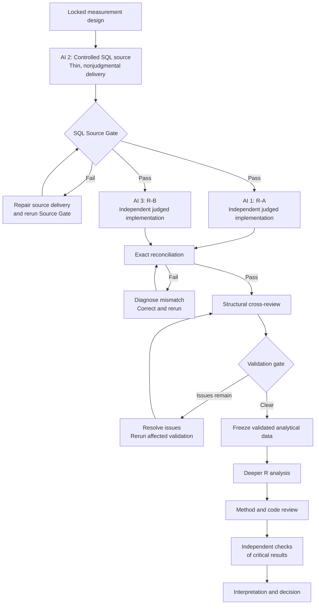
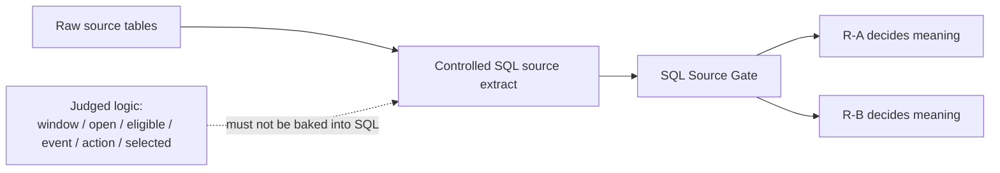

# Three-AI Independent Validation and Analysis Framework

This framework describes an end-to-end system for using three independent AI systems to construct, validate, review, analyze, and interpret business data. It begins with a locked measurement design and ends with an evidence-traceable recommendation.

From this version forward, the default Stage 4 validation architecture is:

> **controlled SQL source delivery → SQL Source Gate → independent R-A and R-B judged implementations → exact reconciliation → structural cross-review → validated-data freeze**

The three AIs perform different functions as the type of error risk changes:

- During source delivery, one AI constructs and audits a thin, nonjudgmental SQL source extract.
- During judged construction, two AIs independently implement the locked Stage 3 logic in R.
- During cross-review, the AIs inspect one another's work for hidden structural weaknesses and shared-source risk.
- During deeper R analysis, they become a builder, a methodological critic, and an implementation critic.
- During interpretation, they test whether the recommendation is genuinely supported by the validated evidence.

The governing principle is:

> Agreement between two independent judged implementations tests whether the locked analytical logic was translated consistently. The SQL Source Gate tests whether both implementations received a faithful source delivery. Cross-review tests whether the implementations share hidden weaknesses. Deeper-analysis review tests whether the conclusions drawn from the validated data are sound.

Earlier projects that used a different independent-validation architecture remain valid historical artifacts. They do not need to be retrofitted merely for conformity. The governing requirement is methodological independence and exact validation, not preservation of one old technology pattern.

## 1. What the system is designed to establish

There are six separate questions. No single test answers all six.

| Validation layer | Central question |
|---|---|
| Measurement validity | Did we define the right population, grain, KPI, comparison, and decision rules? |
| Source-delivery validity | Did SQL faithfully deliver the authorized source records without silently deciding the answer? |
| Construction validity | Did R-A and R-B independently implement the locked judged logic correctly? |
| Structural robustness | Could the two R implementations agree while still containing a hidden weakness or shared misunderstanding? |
| Analytical validity | Are later statistical, descriptive, or predictive methods appropriate? |
| Decision validity | Does the final recommendation actually follow from the validated evidence? |

An exact match between R-A and R-B does not automatically prove that:

- the original measurement design was correct;
- the shared SQL source extract was faithful;
- both paths are safe under every boundary condition;
- later statistical methods are appropriate;
- a predictive association is causal;
- or the final recommendation is justified.

That is why Stage 4 separates **source delivery**, **independent judged construction**, **reconciliation**, and **structural review**.

## 2. Phase 0: Lock the measurement design

Before SQL source delivery or either R builder begins, all three AIs must receive the same controlling measurement design.

The design must specify at least:

- The business decision being supported
- The analytical question
- The unit of analysis
- The population
- Inclusion and exclusion rules
- The primary KPI or decision evidence
- Numerator and denominator when applicable
- Date and time rules
- Required segments
- Thresholds and volume floors
- Treatment of missing values
- Duplicate / identity rules when material
- Comparison groups or baselines
- Decision rules
- Required output columns
- Reconciliation-critical fields
- Known limitations
- Database dialect and source tables
- Source-delivery requirements

### What “locked” means

Once construction begins, no AI may silently reinterpret or improve the measurement design.

If an AI finds ambiguity, it must report it. It cannot independently change:

- the population;
- the KPI definition;
- the grain;
- the date window;
- the threshold;
- duplicate treatment;
- or the decision rule.

An AI may flag a potentially better alternative, but it must still implement the locked definition unless the owner formally changes the design.

This preserves the difference between implementing the owner's decision and reviewing a potential limitation in that decision.

### Freeze known-case fixtures before builders run

Known-case fixtures or equivalent tiny gold cases must be frozen **before R-A or R-B begins implementation or execution**.

The freeze identity should include a path plus content hash and/or freeze timestamp.

A failed fixture is evidence against the implementation, not permission to rewrite the fixture until it passes.

### Version control before construction

Every AI must work from the same versions of:

- the measurement design;
- the database context;
- the schema or data dictionary;
- the data profile;
- the source snapshot;
- the authorized source-delivery contract;
- and the frozen fixture pack.

At minimum, record:

- source-data version or extraction time;
- measurement-design version;
- SQL source script version;
- SQL Source Gate report version;
- R-A script version;
- R-B script version;
- row counts;
- fixture freeze identity;
- and output creation time.

For a rigorous workflow, also calculate file hashes for major inputs and outputs.

## 3. Preserve independence during initial construction

Independence is what makes agreement valuable.

The two judged R paths may both use tidyverse. Independence does **not** require different programming languages, unfamiliar packages, or artificial stylistic differences.

Independence comes from separate construction and information barriers.

Before reconciliation, R-A and R-B may share:

- the locked measurement design;
- the same verified SQL source extract;
- the same schema and column definitions;
- the same frozen fixture pack;
- and the same required output contract.

Before first-pass freeze, they must not share:

- each other's code;
- each other's judged outputs;
- final action or membership ID lists;
- selected sets;
- common prewritten decision functions;
- copied helper functions that encode judged logic;
- or mismatch results that could steer one builder toward the other's answer.

| AI | Initial responsibility | Primary output | Should not see initially |
|---|---|---|---|
| AI 1 | Independently implement locked judged logic in R | R-A judged table | R-B code or judged output |
| AI 2 | Build and audit controlled SQL source delivery | SQL source extract + Source Gate report | No need for judged output before source freeze |
| AI 3 | Independently implement locked judged logic in R | R-B judged table | R-A code or judged output |

The final judged comparison is:

$$
\text{R-A judged table} \quad \text{versus} \quad \text{R-B judged table}
$$

The shared SQL extract is not treated as a third judged answer. It is a controlled input whose fidelity must be proven separately.

## 4. AI 2: Controlled SQL source delivery

### Purpose

The SQL layer is a **data-delivery and source-verification layer**, not a competing analytical decision path.

Its job is to deliver the source fields required by Stage 3 as faithfully and transparently as practical.

The preferred extract is:

- thin;
- traceable to raw source tables;
- minimally transformed;
- broad enough for the R builders to apply the important analytical rules themselves;
- and nonjudgmental with respect to the final Stage 3 decision.

### The bright-line rule

SQL should answer:

> **Did we faithfully deliver the authorized source records and fields?**

R-A and R-B should independently answer:

> **What do those records mean under the locked Stage 3 rules?**

Therefore, unless Stage 3 explicitly classifies a transformation as mechanical source plumbing, the SQL source layer should not precompute judged fields equivalent to:

- `is_in_window`
- `is_open`
- `is_eligible`
- `is_late`
- membership qualification
- `action`
- `selected`
- priority rank
- final KPI classification

If SQL begins deciding the same substantive rules that R-A and R-B are supposed to validate independently, stop and redesign the source extract.

### Raw-ish does not mean careless

SQL may still perform necessary mechanical work, including:

- selecting required source columns;
- joining source tables when the source is relational;
- constructing a documented mechanical source grain when R cannot reasonably consume the raw topology;
- standardizing purely technical encodings;
- attaching lineage fields;
- or applying a broad mechanical extraction envelope when the full source is too large for downstream R.

But every such transformation must be documented and covered by the Source Gate.

### Mechanical extraction envelopes

If data volume makes a full extract impractical, SQL may apply a **broad mechanical envelope** that is intentionally wider or more primitive than the final analytical rule.

For example, SQL may extract records from a broad date range for performance reasons while leaving the actual locked decision window to R-A and R-B.

The Source Gate must then verify that the envelope contains every raw record that satisfies the mechanical extraction condition.

The mechanical envelope must not quietly become the Stage 3 population rule.

## 5. SQL Source Gate

### Purpose

R-A and R-B share one upstream source package. That is efficient and auditable, but it creates a common-dependency risk.

The SQL Source Gate compensates for that risk by establishing that the shared R input is a faithful delivery of the authorized source material.

**Source Gate Pass is required before final validation may be claimed.**

### Minimum Source Gate checks

At minimum, preserve evidence for:

1. Source and extract row counts
2. Identifier coverage
3. Duplicate / repeated-identifier characterization
4. Critical-field value preservation
5. Null / blank profiles for critical source fields
6. Domain checks for important categorical fields
7. Date/time range and parseability checks
8. Join cardinality and row-loss checks when joins exist
9. Mechanical-envelope completeness when an envelope is used
10. Source lineage and exact snapshot identity

### Do not assume the business ID is a physical-row key

A request ID, order ID, seller ID, customer ID, or similar business identifier may repeat.

If a repeated identifier is used as the sole equality-join key during Source Gate validation, the comparison can multiply rows and produce misleading results.

Therefore:

- use a stable raw-row identifier when one exists; or
- compare delivered source rows as a **multiset**, using a reproducible full-row or critical-field fingerprint plus occurrence counts; or
- use another explicitly justified physical-row identity method.

The Source Gate must validate both **value equality** and **multiplicity**.

If the same raw row occurs three times, the delivered extract must preserve three occurrences unless the locked source contract explicitly authorizes otherwise.

### Critical-field equality

For every source field that materially supports Stage 3 logic, the gate should establish that the delivered value matches the raw source value unless a documented mechanical transformation was authorized.

Examples may include:

- entity/request/order ID
- source status
- source type
- creation timestamp
- modification timestamp
- closure timestamp
- duplicate / legacy indicators
- parent identifiers
- geography fields
- source-presence indicators

Any authorized transformation must have its own reproducible check.

### Source Gate output

The Source Gate should mechanically produce a report such as:

| Check | Expected | Actual | Result |
|---|---:|---:|---|
| Missing delivered rows | 0 | 0 | PASS |
| Extra delivered rows | 0 | 0 | PASS |
| Critical-field mismatches | 0 | 0 | PASS |
| Multiplicity mismatches | 0 | 0 | PASS |
| Unexpected row loss from joins | 0 | 0 | PASS |
| Mechanical-envelope omissions | 0 | 0 | PASS |
| Lineage mismatch | 0 | 0 | PASS |

The exact checks depend on the source topology, but “close” is not a Source Gate pass.

### Source Gate failure

If the Source Gate fails:

- do not treat either R path as validated;
- repair the SQL source delivery or the gate itself;
- regenerate the source package;
- rerun the entire Source Gate;
- preserve the failed report;
- and invalidate downstream R outputs if their source package changed.

## 6. AI 1 and AI 3: independent judged R builders

### Purpose

R-A and R-B independently implement the complete judged logic defined by Stage 3.

They receive the same verified source package, but neither is allowed to use the other as a template or answer key.

Both may use tidyverse and owner-familiar R idioms.

### R-A responsibilities

AI 1 should independently:

1. Load and verify the authorized source package.
2. Confirm expected keys and duplicate behavior.
3. Parse dates and timestamps.
4. Apply the locked decision window.
5. Apply the locked population and eligibility rules.
6. Apply duplicate / identity logic where specified.
7. Construct required events, flags, numerators, denominators, or scores.
8. Apply thresholds, floors, membership rules, and capacity logic when used.
9. Produce the complete required judged table.
10. Preserve intermediate audit counts.

A direct sequential tidyverse pipeline is acceptable if it faithfully implements the design.

### R-B responsibilities

AI 3 independently performs the same Stage 3 contract but should construct it from its own reasoning and code.

It may use a different internal strategy, such as:

- separate rule tables;
- independently constructed helper functions;
- staged joins of rule components;
- explicit assertions between steps;
- or another clear tidyverse structure.

Different syntax is not the goal. Independent reasoning and construction are the goal.

### Preserve audit information

Both R paths should preserve enough intermediate evidence to locate divergence, such as:

- input row count;
- key counts;
- duplicate counts;
- parse-failure counts;
- window inclusion counts;
- eligibility counts;
- exclusion counts by reason;
- numerator / denominator totals when applicable;
- threshold-pass counts;
- action counts;
- selected counts;
- and any Stage 3-specific twin, persistence, or capacity audit fields.

## 6A. Pre-build enforcement checklist

Keep the dual-builder + exact-recon architecture. Harden checklist enforcement so Stage 3 translation gaps are less likely to ship uncaught.

The checklist below is mandatory before Validation Gate Pass.

### Pre-build attestation

Before implementation or execution begins, each path must attest to its own locked contract with Stage 3 clause cites.

**Path-contract split:**

- **SQL source path** attests that it supplies the required source fields / mechanical grain, preserves authorized values, contains no prohibited judged logic, and can pass the SQL Source Gate.
- **R-A** independently attests that it implements the complete judged / final decision logic.
- **R-B** independently attests that it implements the complete judged / final decision logic.

Optional persistence, twin, capacity, and simulation mechanics may be marked **N/A** only with an explicit design cite that the mechanic is unused. Packet completeness, lineage, source fidelity, and judged-path independence remain mandatory.

### Judged-path decision-logic items

R-A and R-B must independently attest to every Stage 3 decision-changing rule that applies, including when relevant:

1. Full analytical-unit universe
2. Window semantics and exact boundaries
3. Open / closed or state semantics
4. Eligibility and exclusion logic
5. Duplicate / entity identity treatment
6. Numerator / denominator construction
7. Persistence / split-window mechanics
8. Dual-clock / twin semantics
9. Membership-first selection
10. Capacity and no-padding rules
11. Non-enrolling / inconclusive actions
12. Final action and selected logic

No single-rule attestation is sufficient when multiple gates are locked.

### All-path lineage requirements

All paths must carry or reference the same frozen-source identity:

- `snapshot_id` or locked equivalent;
- `source_version` or locked equivalent;
- extraction / observation-boundary equivalent;
- and fixture-pack freeze identity when fixtures are used.

Blank, `PENDING`, or placeholder lineage fails Stage 4 readiness.

### Known-case fixtures before recon (Fixture Gate)

**Fixture Gate Pass is required before reconciliation may claim Pass.**

1. **Freeze before builders run.** Record fixture-pack freeze identity before R-A or R-B begins implementation or execution.
2. **Score the frozen pack.** Run the Stage 3 gold fixtures against both R-A and R-B using the frozen text.
3. **No rewrite after Fail.** On fixture Fail, repair the implementation toward locked Stage 3 and rerun. Builders must not rewrite fixture IDs, expected outcomes, or predicates to greenwash.
4. **Owner-authorized correction = new freeze.** A legitimate fixture correction creates a new version and requires fresh validation.
5. **Block recon-green.** A fixture Fail, missing freeze identity, or post-fail rewritten pack blocks Validation Gate Pass.

The SQL source path does not need to predict fixture actions. Its fixture-related responsibility is to faithfully deliver fixture/source fields when fixture delivery is part of the test harness.

### Hard recon contract

Validation Gate Pass requires **exact** match between R-A and R-B on the locked decision-grain fields.

At minimum, when present in the design:

| Field class | Exact-match expectation |
|---|---|
| Universe | Same analytical-unit universe, including zero-eligible / non-qualifiers when required |
| Components | Numerator, denominator, counts, and secondary components when locked |
| State / eligibility | Same window, open/state, eligibility, and exclusion classifications |
| Action | Identical final action codes |
| Membership / selected | Identical membership and selected/capacity outcome sets |
| Persistence audit | Same half / persistence components when used |
| Twin / disagree | Same twin actions, evidence fields, and disagreement flags when used |
| Lineage | Same frozen source and fixture identities |

No “close enough” on classifications, membership, action, selected status, or identifiers.

### Mismatch diagnosis / never-copy

**Build-time independence:** R-A and R-B must not share a judged ID list, action list, selected set, or membership list as an input.

**Repair-time never-copy:** On any mismatch:

1. Diagnose against the locked Stage 3 design.
2. Do not assume either R path is automatically correct.
3. Repair by changing code and rerunning from source.
4. Never copy the other path's judged IDs, selected set, or membership list into the failing implementation.
5. Never manually edit result tables to force agreement.
6. Never invent pad membership to fill a capacity target.
7. Preserve the failed reconciliation report.
8. Log root-cause class: source delivery, translation miss, plumbing, shared design error, or reconciliation bug.

### Simulation / release block

When the design is simulation-only or otherwise non-live:

1. Judged/export outputs must be labeled simulation-only / not live release.
2. Missing non-live labeling blocks a live claim.
3. Validation Gate Pass unlocks Stage 5 interpretation of the validated pack; it does not create operational release authority.
4. Live release remains a separate owner decision after current data and operational prerequisites.

When capacity/simulation is unused, this block is design-cited N/A.

### §6A checklist spine

| # | Item | Blocking if missing / soft |
|---|---|---|
| 1 | Packet-complete Stage 3 → path translation | Yes |
| 2 | SQL Source Gate Pass | Yes |
| 3 | Fixture Gate Pass | Yes |
| 4 | R-A and R-B independent judged construction | Yes |
| 5 | Exact recon on locked decision fields | Yes |
| 6 | Build-time independence + repair-time never-copy | Yes |
| 7 | Snapshot / lineage fields present and aligned | Yes |
| 8 | Plumbing adaptations disclosed | Yes |
| 9 | Simulation / release ceiling honored when applicable | Yes |

## 7. Exact reconciliation

### What must be compared

Reconciliation compares **R-A against R-B**, not the SQL source extract against a judged table.

The reconciliation must compare more than a final percentage or summary count.

#### Structure

- Required column names
- Data types where comparison-critical
- Grain
- Number of rows
- Key uniqueness or locked duplicate behavior

#### Entity coverage

- Keys appearing only in R-A
- Keys appearing only in R-B
- Keys appearing in both

#### Decision components

For every analytical entity, compare all Stage 3 reconciliation-critical fields, such as:

- window inclusion;
- open/state classification;
- eligibility;
- exclusion reason when locked;
- numerator;
- denominator;
- primary metric;
- threshold status;
- membership;
- action;
- selected/capacity outcome;
- and required audit/twin/persistence fields.

### Global control totals

Global controls should mirror the locked design and may include:

- total analytical entities;
- total eligible entities;
- total event counts;
- total denominators;
- action counts;
- selected counts;
- inconclusive counts;
- and any required segment totals.

### Exactness standard

For identifiers, counts, logical flags, action codes, membership, selected state, and eligibility classifications, exact means exact.

There should be:

- zero unmatched keys;
- zero classification differences;
- zero action differences;
- zero selected differences;
- and zero count-component differences.

Rates or continuous values should be compared using unrounded underlying values and a predetermined machine-level tolerance only when representation differences make that necessary.

Two displayed values that round to the same number are not reconciled if their underlying components differ.

### Reconciliation output

The reconciliation process should mechanically generate a report containing:

- pass/fail status;
- table-level row-count comparison;
- unmatched-key count;
- duplicate-key failure count when uniqueness is expected;
- differing-row count;
- differing-column count;
- action mismatch count;
- selected mismatch count;
- maximum permitted numerical difference where applicable;
- global-control-total comparison;
- and a mismatch table when differences exist.

It should not depend on an AI visually inspecting two spreadsheets and deciding they look the same.

## 8. What happens if reconciliation fails

A mismatch does not establish which implementation is wrong.

R-A could be wrong. R-B could be wrong. The reconciliation code could be wrong. A shared source-delivery defect could also be involved.

The system must not automatically treat one path as the answer key.

### Initial mismatch classification

Common categories include:

- different key sets;
- different window filters;
- duplicate treatment;
- grain changes;
- date-boundary handling;
- timezone conversion;
- null / `NA` handling;
- date-versus-timestamp logic;
- denominator eligibility;
- threshold handling;
- aggregation order;
- integer-versus-floating arithmetic;
- source-delivery loss;
- or comparison-format problems.

### Failure-investigation responsibilities

#### AI 1

AI 1 reviews R-A against the locked design, mismatch keys, fixtures, and intermediate audit counts. It explains how R-A produced the disputed rows without assuming R-B is correct.

#### AI 2

AI 2 reviews the SQL source delivery and Source Gate against raw source evidence. It determines whether shared input rows were lost, duplicated, transformed, or misidentified.

#### AI 3

AI 3 reviews R-B against the locked design, mismatch keys, fixtures, data types, grouping, date conversion, and intermediate audit counts without assuming R-A is correct.

### Evidence-based resolution

After independent diagnoses, the AIs may see one another's explanations and challenge them.

Resolve mismatches using:

- row-level source evidence;
- Source Gate evidence;
- intermediate counts;
- frozen fixtures;
- the locked specification;
- and reproducible calculations.

Do not resolve by two-to-one vote.

### Rerun rule

After any material correction:

1. Rebuild the affected output from its authorized source.
2. Rerun relevant integrity checks.
3. Rerun fixtures when judged logic changed.
4. Rerun the complete reconciliation.
5. Create a new reconciliation report.
6. Preserve the earlier failed report for the audit trail.

If the SQL source package changes, rerun the Source Gate and rebuild **both** R paths from the new frozen source package.

Manual edits to result tables are prohibited.

## 9. Cross-review after reconciliation

### Why cross-review is separate

Suppose R-A and R-B match exactly.

That is strong evidence that two independent R implementations translated the locked design to the same result. It still does not prove that the shared answer is structurally safe.

Both paths might still share:

- the same misunderstanding of an ambiguous Stage 3 rule;
- the same mistaken assumption about a source field;
- the same date interpretation;
- a shared-source defect not caught by an inadequate Source Gate;
- a null case absent from current data;
- or a threshold error that happens not to affect current entities.

Reconciliation tests observed agreement. Cross-review looks for weaknesses that may not have produced an observed difference.

### Cross-review assignments

Once reconciliation passes, the information barriers are removed.

| Reviewer | Primary artifacts reviewed |
|---|---|
| AI 1 | R-B + SQL Source Gate / source-delivery assumptions |
| AI 2 | R-A + R-B, especially judged-logic leakage from the common source |
| AI 3 | R-A + SQL Source Gate / source-delivery assumptions |

Each judged implementation must receive meaningful review from an AI that did not author it.

### Cross-review checklist

#### Compliance with the locked design

- Does each R path implement every locked rule?
- Was anything added, omitted, or reinterpreted?
- Did either path rely on a field that already encoded the answer?
- Are primary and secondary metrics correctly distinguished?
- Are thresholds and floors applied at the correct stage?

#### Source delivery

- Is the SQL extract genuinely nonjudgmental?
- Were required raw fields retained?
- Did a mechanical envelope become an analytical filter by accident?
- Were source joins cardinality-safe?
- Were critical values preserved?
- Does the Source Gate validate multiplicity as well as ID presence?

#### Grain and identity

- Is each intermediate table at its declared grain?
- Are repeated business IDs legitimate or accidental?
- Is deduplication explicitly authorized?
- Could aggregation hide duplicate records?
- Is entity identity handled consistently across both R paths?

#### Joins

- What is the expected cardinality of every join?
- Are unique keys actually unique?
- Could an inner join remove valid population members?
- Could a left join create missing attributes?
- Could future duplicate lookup keys multiply records?
- Are join assertions present where needed?

#### Dates and time

- Are timestamps parsed consistently?
- Is the lower boundary inclusive when locked?
- Is the upper boundary exclusive when locked?
- Could timezone conversion alter the calendar date?
- Are missing or invalid timestamps handled explicitly?

#### Missing values

- Are missing values excluded, retained, or classified according to the design?
- Could a missing comparison become `FALSE` and be counted as a valid negative?
- Are missing identifiers possible?
- Does a missing lookup value remove an otherwise valid observation?

#### Boundary conditions

Reviewers should inspect design-specific cases such as:

- observation exactly at the start boundary;
- observation exactly at the end boundary;
- missing critical timestamps;
- duplicate identifiers;
- threshold values immediately below, exactly at, and immediately above a cutoff;
- zero-denominator or zero-event entities when relevant;
- capacity boundaries when relevant;
- and conflicting twin / secondary evidence when relevant.

#### Reproducibility

- Are package versions or environment requirements recorded?
- Are transformations deterministic?
- Are intermediate outputs generated from code?
- Can another analyst rerun the process?
- Can the exact source snapshot be recovered or identified?

### Counterexample testing

Cross-review should not be limited to reading code.

Reviewers should construct or reuse frozen synthetic cases representing dangerous boundaries. Expected results must come from the locked specification, not from whichever R implementation currently passes.

### Cross-review finding format

Every finding should contain:

- Finding ID
- Reviewer
- Artifact
- Severity
- Relevant locked rule
- Description
- Evidence
- Possible impact
- Required correction
- Owner
- Resolution
- Retest result

Suggested severity categories:

- **Blocking:** Could change the population, grain, KPI, action, membership, or decision.
- **Material:** Could change a meaningful subset or make future reruns unreliable.
- **Minor:** Readability, maintainability, or performance issue without a credible result effect.

### Resolving cross-review findings

1. Reviewer records the finding.
2. Author responds with evidence.
3. Code is corrected if necessary.
4. A different AI verifies the correction.
5. Any source-delivery change triggers Source Gate rerun plus rebuild of both judged paths.
6. Any judged-construction change triggers fixture rerun and exact reconciliation.
7. The finding is marked resolved, accepted limitation, or unresolved.

If a reviewer discovers a problem in the locked measurement design itself, the AI must escalate it. The AIs cannot silently rewrite the design.

### Cross-review gate

The process moves forward only when:

- SQL Source Gate still passes;
- Fixture Gate still passes;
- exact R-A / R-B reconciliation still passes;
- no blocking structural issue remains;
- no material issue remains unresolved;
- accepted limitations are documented;
- and required corrections have been independently verified.

## 10. Freeze the validated analytical data

Once the SQL Source Gate, Fixture Gate, reconciliation, and cross-review pass, the validated data should receive a stable version.

Otherwise, deeper analysis could unknowingly use:

- a refreshed source extract;
- a changed SQL source query;
- a changed R implementation;
- a manually edited CSV;
- or a differently filtered dataset.

The frozen package should include:

- validated analytical dataset;
- row count;
- key-uniqueness or duplicate-profile results;
- `snapshot_id` or locked equivalent;
- `source_version` or locked equivalent;
- extraction time and/or locked observation boundary;
- source-delivery provenance notes;
- SQL source script version;
- SQL Source Gate report;
- R-A version;
- R-B version;
- Fixture Gate freeze identity and results;
- reconciliation script and report;
- cross-review register;
- simulation / non-live release labels when applicable;
- dual-path independence + never-copy attestations;
- and a dataset hash where feasible.

Blank or `PENDING` lineage fields fail freeze.

### The boundary of validation

Validation applies only to the data and variables that were actually tested.

If deeper R analysis introduces:

- a new table;
- a new join;
- a new population restriction;
- a new outcome variable;
- a new time window;
- or new feature engineering,

those additions are not automatically validated by the earlier R-A / R-B reconciliation. They require a smaller validation cycle appropriate to the new material.

## 11. Deeper R analysis

[docs/ENGINE.md](ENGINE.md) may be used after the validation gate as an optional execution aid for deeper R analysis and reporting.

It is **not** the default generator for both independent validation builders.

Do not generate R-A and R-B from one common ENGINE.md-produced implementation, shared function library, or common judged-code template. That would weaken meaningful independence.

ENGINE.md may guide general owner-familiar coding conventions if it does not transmit substantive judged logic from one builder to the other, but the safest default is to reserve it for post-validation analysis.

### R's role changes

Before the validation gate, R is the duplicated judged implementation layer: R-A and R-B independently build the core validated result.

After the gate, R becomes the primary analytical engine for work that does not need to be duplicated end-to-end, including:

- Descriptive analysis
- Distribution analysis
- Segmentation
- Visualization
- Hypothesis testing
- Feature engineering
- Predictive modeling
- Forecasting
- Sensitivity analysis
- Interpretation
- Decision support

### Do not begin deeper analysis with code

Before AI 1 writes the deeper R project, it should create an analysis plan specifying:

- analytical question;
- outcome variable;
- unit of analysis;
- required features;
- descriptive analyses;
- statistical tests;
- segmentation;
- model class, if any;
- train/test or temporal split;
- evaluation metrics;
- comparison baseline;
- decision thresholds;
- and intended outputs.

AI 2 should review the proposed method before extensive code is written. AI 3 should confirm that the required data and transformations are available.

## 12. Roles during deeper analysis

### AI 1: Analytical builder

AI 1 becomes the primary builder. Its responsibilities include:

- constructing the main R analysis;
- using the frozen validated data;
- producing tables and visualizations;
- implementing approved statistical methods;
- building models or forecasts;
- saving intermediate analytical objects;
- generating held-out predictions;
- and documenting how each output was produced.

AI 1 owns the coherent primary pipeline.

This is more useful than having all three AIs produce three complete deeper-analysis projects. The dual-build requirement applies to the core Stage 4 judged result; deeper analysis uses targeted independent verification instead of triplicating the entire project.

### AI 2: Methodological and statistical critic

AI 2 evaluates whether the analysis is conceptually and statistically defensible.

#### Descriptive analysis

- Are comparisons made at the correct grain?
- Are weighted and unweighted summaries distinguished?
- Are denominators consistent across segments?
- Are tiny segments being overinterpreted?
- Are distributions hidden by averages?

#### Statistical testing

- Is the test appropriate for the data?
- Are independence assumptions plausible?
- Are sample sizes sufficient?
- Are effect sizes reported alongside significance?
- Are confidence intervals included where appropriate?
- Is multiple testing controlled?
- Is statistical significance being confused with business importance?

#### Predictive modeling

- Is the target clearly defined?
- Is the prediction unit correct?
- Is the data split appropriate?
- Should the split be random or temporal?
- Is information leakage present?
- Were transformations learned only from training data?
- Is class imbalance handled appropriately?
- Is accuracy an appropriate metric?
- Is there a baseline model?
- Was the test set used only for final evaluation?
- Are probability calibration and threshold choice relevant?
- Is predictive importance being misrepresented as causation?

#### Forecasting

- Is chronological order preserved?
- Is the forecast horizon aligned with the business decision?
- Is rolling-origin validation used where appropriate?
- Are seasonality and trend handled?
- Are prediction intervals reported?
- Is the forecast compared with a naive baseline?

#### Interpretation

- Does the language distinguish descriptive, associational, predictive, and causal claims?
- Are limitations material to the recommendation disclosed?
- Does the method actually answer the locked analytical question?

AI 2 can reject a method even if the code executes perfectly.

### AI 3: Code and data implementation critic

AI 3 reviews whether the approved analytical plan was correctly translated into R.

#### Data integrity

- Was the correct frozen dataset loaded?
- Are keys still unique where expected?
- Did a new join change the row count?
- Were records accidentally removed?
- Did the grain change?
- Are group totals consistent with global totals?

#### Data types and missingness

- Were timestamps parsed correctly?
- Were categorical variables converted properly?
- Were missing values handled as intended?
- Were missing categories silently dropped?
- Did imputation use training data only?

#### Tidyverse behavior

- Was lingering grouping left in place?
- Did `summarise()` or `mutate()` operate at the intended level?
- Did a many-to-many join create duplicates?
- Were factors reordered or collapsed correctly?
- Did pivoting alter uniqueness?

#### Modeling implementation

- Was the split created before preprocessing?
- Was the recipe prepared only on training data?
- Were test data used during tuning?
- Are truth and prediction columns aligned?
- Is the positive class correctly defined?
- Was the correct probability column used?
- Are metrics calculated on the intended held-out observations?
- Are model seeds and resampling objects reproducible?
- Are predictions joined back to entities without reordering errors?

#### Output integrity

- Do tables use the correct denominator?
- Do chart labels match the plotted variables?
- Are percentages presented as percentages?
- Are axes misleadingly truncated?
- Are model results taken from the final approved model?
- Does the exported output match the in-memory result?

AI 3 can approve the method in principle while finding that its implementation is wrong.

## 13. Independently verify critical results

Not every chart, table, or model must be reproduced three times.

Independent reproduction should focus on outputs that materially support the decision, including:

- primary segment rankings;
- effect estimates;
- confidence intervals;
- model accuracy or ROC AUC;
- recall for a priority class;
- forecast error;
- top risk classifications;
- revenue-uplift calculations;
- and decision-threshold results.

### Example: independently checking model accuracy

Suppose AI 1 reports:

> Held-out model accuracy = 82.4%.

AI 2 should receive the held-out truth and prediction columns and independently calculate:

$$
\text{Accuracy}
=
\frac{\text{Correct held-out predictions}}
{\text{All held-out predictions}}
$$

AI 2 should confirm:

- the number of held-out rows;
- the number of correct predictions;
- the resulting accuracy;
- that duplicate predictions are absent;
- and that all rows belong to the untouched test set.

AI 3 separately checks:

- how the test set was created;
- whether it entered preprocessing or tuning;
- whether predictions correspond to the correct rows;
- whether the correct model object was used;
- and whether the metric code references the intended columns.

These are different checks:

- AI 2 asks whether the reported result is calculated correctly and methodologically meaningful.
- AI 3 asks whether the pipeline genuinely produced a valid held-out prediction set.

### Targeted reproduction protocol

For each critical result:

1. Identify the exact claim.
2. Identify the source analytical object.
3. Identify the required numerator, denominator, or formula.
4. Have a non-builder independently recompute it.
5. Compare the independently calculated result with the reported result.
6. Investigate any difference.
7. Preserve the check as an artifact.

The reviewer should calculate from underlying data or saved predictions, not copy the value from AI 1's summary table.

## 14. Review loop for deeper analysis

### First review round

After AI 1 completes the analysis:

- AI 2 submits a methodological review.
- AI 3 submits an implementation review.
- Neither reviewer initially edits AI 1's code.
- Each finding identifies evidence and possible impact.

### Builder response

AI 1 responds to each finding by accepting it, disputing it with evidence, asking for clarification, or explaining why it does not affect the result.

If a change is required, AI 1 modifies the analysis and reruns affected outputs.

### Verification round

The original reviewer verifies the correction. For important changes, the other reviewer also checks for downstream consequences.

### No voting rule

Disagreements are not resolved by majority vote.

An objection is resolved by:

- specification;
- mathematical definition;
- source data;
- code execution;
- statistical principle;
- or a targeted independent check.

If the disagreement represents a genuine methodological choice with no single demonstrably correct answer, both alternatives should be documented and tested through sensitivity analysis where practical.

## 15. Interpretation and recommendation

A valid model or statistical result does not automatically dictate a business recommendation.

The final phase must connect:

$$
\text{Validated data}
\rightarrow
\text{Analytical result}
\rightarrow
\text{Interpretation}
\rightarrow
\text{Decision rule}
\rightarrow
\text{Recommendation}
$$

Each link must be visible.

### AI responsibilities during interpretation

#### AI 1: Draft the synthesis

AI 1 produces the initial decision narrative:

- What was found?
- Why does it matter?
- Which decision option is supported?
- What should be done next?
- What uncertainty remains?

#### AI 2: Challenge the inference

AI 2 checks:

- whether associations are being described causally;
- whether uncertainty is understated;
- whether alternative explanations remain;
- whether the model is strong enough for the proposed use;
- whether decision thresholds were defined in advance;
- and whether the recommendation exceeds what the method can support.

#### AI 3: Trace claims to outputs

AI 3 verifies:

- that every number in the narrative matches an approved output;
- that segment labels are correct;
- that chart values match tables;
- that model metrics come from the held-out set when applicable;
- and that the recommendation uses the correct validated population.

### Claim-to-evidence ledger

Every important final claim should be linked to its source dataset, calculation, table or model object, independent check, and material limitation.

| Final claim | Evidence | Independent check | Limitation |
|---|---|---|---|
| Priority group materially exceeds the locked comparison | Validated judged table | Recomputed contrast | Descriptive unless causal design exists |
| Model accuracy is 82.4% | Held-out predictions | Independent calculation | Accuracy may conceal minority-class errors |
| Action is recommended for specified entities | Validated action table | Rule trace | Depends on locked thresholds and population |

### Final decision standard

The final recommendation should answer:

- Which decision option is supported?
- What evidence supports it?
- What evidence would contradict it?
- What risks or limitations remain?
- What action should occur next?
- What result should be monitored after action?

The executive output can ultimately be compressed into three decision bullets, one primary chart, and three next actions. That compact output should sit on top of the complete evidence trail described here.

## 16. Required artifacts

| Artifact | Purpose |
|---|---|
| Locked measurement design | Controlling analytical specification |
| Database context | Tables, keys, relationships, and SQL constraints |
| Data profile | Counts, missingness, ranges, and distributions |
| Controlled SQL source script | Thin, nonjudgmental source delivery |
| SQL source extract | Shared verified input supplied to R-A and R-B |
| SQL Source Gate report | Evidence that delivery matches the authorized raw source |
| Source-delivery manifest | Snapshot, lineage, row counts, fields, and transformations |
| Frozen fixture pack | Pre-build known-case authority |
| R-A script | First independent judged implementation |
| R-A output | First judged analytical table |
| R-B script | Second independent judged implementation |
| R-B output | Second judged analytical table |
| Reconciliation script | Mechanical R-A versus R-B comparison |
| Reconciliation report | Evidence that the judged outputs match exactly |
| Cross-review reports | Structural critique of source and both R paths |
| Issue register | Findings, responses, corrections, and dispositions |
| Validated-data manifest | Version, counts, provenance, and hashes |
| Deeper R analysis | Main post-validation analytical pipeline |
| Methodological review | Statistical and inferential critique |
| Implementation review | R code and data-integrity critique |
| Critical-result checks | Independent reproduction of key outputs |
| Interpretation review | Claim-to-evidence verification |
| Final recommendation | Decision and next actions |

## 17. What each gate proves and does not prove

| Gate | What passing establishes | What it does not establish |
|---|---|---|
| Measurement design locked | Everyone is implementing the same specification | The specification is necessarily the best business definition |
| SQL Source Gate passes | Shared R input faithfully satisfies the authorized source-delivery contract | The Stage 3 judged logic is correct |
| Fixture Gate passes | Both judged paths handle frozen known cases as specified | Production data contains no untested edge case |
| R-A versus R-B match | Independent judged paths produced the same locked result on the frozen source | Both paths cannot share a conceptual misunderstanding |
| Cross-review passes | No unresolved material structural defect was found | Every future data change will remain valid |
| Deeper-analysis review passes | Method and implementation are defensible | Predictions will remain accurate indefinitely |
| Critical results reproduce | Key reported values are computationally supported | Interpretation is automatically causal |
| Interpretation review passes | Recommendation is traceable to evidence and decision rules | The business action is risk-free |

### Validation Gate Pass ceiling for simulation

When the validated pack is simulation-only / non-live:

| Passing establishes | Passing does not establish |
|---|---|
| Source delivery, fixtures, judged-path reconciliation, and structural review passed for the labeled simulation pack | Live operational release authority |
| Stage 5 may interpret that labeled pack | That the roster is current for live occupancy or that all shared-design error is impossible |

Live release remains a separate owner decision after current data and operational prerequisites.

## 18. Complete operating sequence

1. Lock what must be measured in Stage 3.
2. Freeze the known-case fixture pack before builders run.
3. Record source snapshot, lineage, schema, and source-delivery contract.
4. Have AI 2 construct the thin, nonjudgmental controlled SQL source delivery.
5. Run the SQL Source Gate against the authorized raw source.
6. If the Source Gate fails, repair source delivery and rerun it before downstream validation proceeds.
7. Freeze the verified source package.
8. Give the same locked Stage 3 specification, verified source package, fixture pack, and output contract to AI 1 and AI 3 separately.
9. Have AI 1 build R-A independently.
10. Have AI 3 build R-B independently.
11. Preserve information barriers until both first-pass judged outputs are frozen.
12. Score frozen known-case fixtures against both judged paths.
13. If either fixture path fails, repair toward locked Stage 3; do not rewrite the failed fixture to force a pass.
14. Reconcile R-A against R-B mechanically on all locked decision-critical fields.
15. If they differ, diagnose without treating either path as automatically correct.
16. Check whether the disagreement originates in R-A, R-B, reconciliation code, or the common source-delivery layer.
17. Correct code, rebuild from source, rerun affected gates, and preserve failed reports.
18. After exact reconciliation, remove the information barriers.
19. Cross-review both R implementations and the SQL Source Gate for hidden structural weaknesses.
20. Resolve every material finding through evidence, not voting.
21. Rerun the Source Gate if source delivery changes.
22. Rerun fixtures and reconciliation if judged construction changes.
23. Freeze the validated analytical data and complete the validation manifest.
24. Use AI 1 to build deeper R analysis when needed.
25. Use AI 2 to review methodology.
26. Use AI 3 to review code and data implementation.
27. Independently reproduce critical post-validation results that support the decision.
28. Correct and revalidate analytical defects.
29. Trace every final claim to an approved analytical output.
30. Produce the interpretation, decision evaluation, and recommendation.

The core philosophy is:

> **Faithful source delivery first, independent judged construction before agreement, exact reconciliation before trust, adversarial review after agreement, specialized review during deeper analysis, and evidence-based resolution throughout.**

That is what turns three AIs from potentially redundant code generators into a controlled analytical validation system while keeping the substantive validation code in an R/tidyverse style the human analyst can personally inspect and audit.

## Framework refinement

This document is a canonical Stage 4 framework artifact. Proposed reusable changes to the execution, source-gate, fixture, reconciliation, independence, or review architecture should be evaluated through the [Three-Model Framework Ablation Protocol](framework-refinement/three-model-ablation-protocol.md), under the frozen [Ablation Constitution](framework-refinement/ablation-constitution.md).

Only ablations returning `KEEP` may authorize a reusable Stage 4 framework change. Mechanical disagreement between Builder and Validator is a `HALT`, not a silent `REVERT`, so that disagreement retains its diagnostic value.
